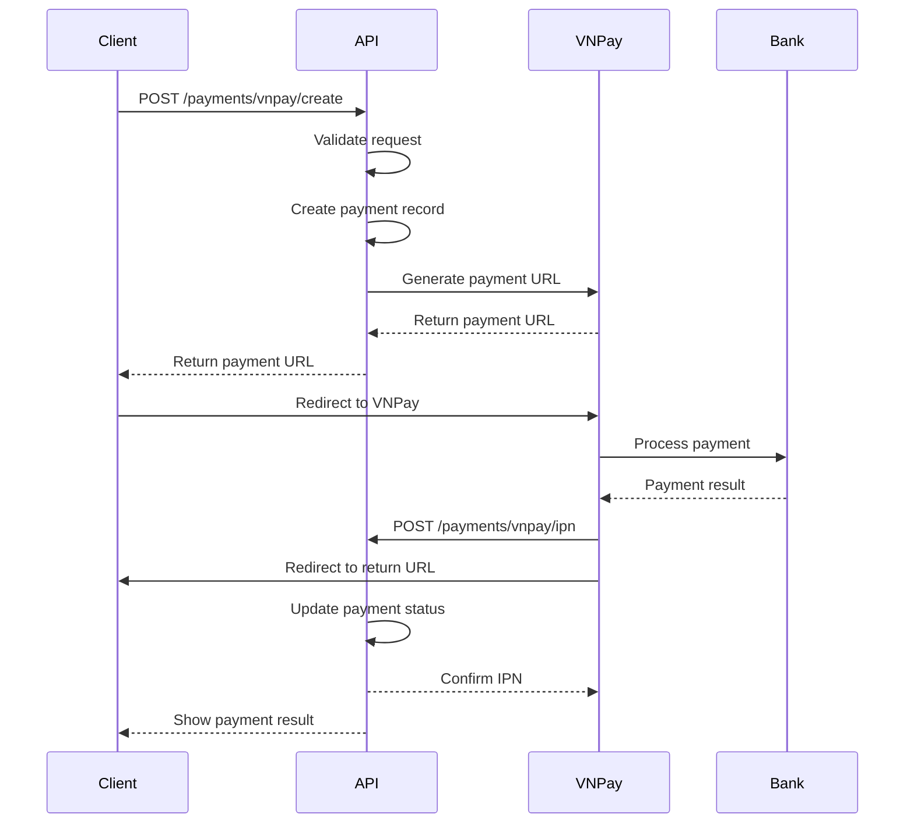

# 📋 VNPay Payment Methods API Documentation

## 🎯 Tổng quan

Tài liệu này mô tả chi tiết các phương thức thanh toán VNPay và cách tích hợp vào hệ thống Beauty Clinic API.

## 🔧 Cấu hình VNPay

### File: `config/vnpay.php`
```php
<?php
return [
    'tmn_code' => env('VNPAY_TMN_CODE', 'TDCER7JD'),
    'hash_secret' => env('VNPAY_HASH_SECRET', 'L308ZO12MJ2UQV63A61L7GDCS4VTIYS3'),
    'url' => env('VNPAY_URL', 'https://sandbox.vnpayment.vn/paymentv2/vpcpay.html'),
    'return_url' => env('VNPAY_RETURN_URL', 'http://localhost:8000/api/v1/payments/vnpay/return'),
    'api_url' => env('VNPAY_API_URL', 'https://sandbox.vnpayment.vn/merchant_webapi/api/transaction'),
];
```

## 💳 Các Phương Thức Thanh Toán

### 1. **Cổng thanh toán VNPAYQR** (Mặc định)
- **bank_code**: `""` (rỗng)
- **Mô tả**: Chuyển hướng sang cổng VNPay để khách hàng chọn phương thức thanh toán
- **Ưu điểm**: Hỗ trợ tất cả phương thức thanh toán
- **Nhược điểm**: Khách hàng phải chọn phương thức trên cổng VNPay

### 2. **Thanh toán bằng ứng dụng hỗ trợ VNPAYQR**
- **bank_code**: `"VNPAYQR"`
- **Mô tả**: Thanh toán qua ứng dụng di động hỗ trợ VNPAYQR
- **Yêu cầu**: Khách hàng cần có ứng dụng ngân hàng hỗ trợ VNPAYQR
- **Phí**: Thường miễn phí hoặc phí thấp

### 3. **Thanh toán qua thẻ ATM/Tài khoản nội địa**
- **bank_code**: `"VNBANK"`
- **Mô tả**: Thanh toán qua thẻ ATM hoặc tài khoản ngân hàng nội địa
- **Hỗ trợ**: Tất cả ngân hàng Việt Nam
- **Phí**: Theo quy định của từng ngân hàng

### 4. **Thanh toán qua thẻ quốc tế**
- **bank_code**: `"INTCARD"`
- **Mô tả**: Thanh toán qua thẻ Visa, Mastercard, JCB
- **Hỗ trợ**: Thẻ quốc tế được chấp nhận tại Việt Nam
- **Phí**: Thường cao hơn thẻ nội địa

## 🚀 API Endpoints

### 1. **Tạo URL thanh toán VNPay**

**Endpoint**: `POST /api/v1/payments/vnpay/create`

**Request Body**:
```json
{
    "booking_id": 1,
    "bank_code": "VNBANK",
    "language": "vi",
    "guest_email": "guest@example.com",
    "guest_phone": "0123456789"
}
```

**Parameters**:
- `booking_id` (required): ID của booking cần thanh toán
- `bank_code` (optional): Mã phương thức thanh toán
  - `""` - Cổng VNPay (mặc định)
  - `"VNPAYQR"` - Ứng dụng VNPAYQR
  - `"VNBANK"` - Thẻ ATM/Tài khoản nội địa
  - `"INTCARD"` - Thẻ quốc tế
- `language` (optional): Ngôn ngữ giao diện (`"vi"` hoặc `"en"`)
- `guest_email` (optional): Email khách hàng (cho guest)
- `guest_phone` (optional): Số điện thoại khách hàng (cho guest)

**Response**:
```json
{
    "success": true,
    "message": "Payment URL created successfully",
    "data": {
        "id": 1,
        "booking_id": 1,
        "amount": 500000,
        "currency": "VND",
        "payment_method": "vnpay",
        "status": "pending",
        "transaction_id": "BK1_20251028114422",
        "vnpay_url": "https://sandbox.vnpayment.vn/paymentv2/vpcpay.html?vnp_Amount=50000000&vnp_Command=pay&vnp_CreateDate=20251028114922&vnp_CurrCode=VND&vnp_ExpireDate=20251028120422&vnp_IpAddr=127.0.0.1&vnp_Locale=vi&vnp_OrderInfo=Thanh%20toan%20don%20hang%20%231&vnp_OrderType=other&vnp_ReturnUrl=http%3A%2F%2Flocalhost%3A8000%2Fapi%2Fv1%2Fpayments%2Fvnpay%2Freturn&vnp_TmnCode=TDCER7JD&vnp_TxnRef=BK1_20251028114422&vnp_Version=2.1.0&vnp_SecureHash=abc123...",
        "metadata": {
            "bank_code": "VNBANK",
            "language": "vi",
            "created_timestamp": "20251028114422"
        },
        "timestamps": {
            "created_at": "2025-10-28T11:44:22.000000Z",
            "updated_at": "2025-10-28T11:44:22.000000Z"
        },
        "booking": {
            "id": 1,
            "total_amount": 500000,
            "status": "confirmed"
        }
    },
    "meta": null,
    "trace_id": "fea483a5-f191-4d7a-924d-f236e78d1126",
    "timestamp": "2025-10-28T04:22:14.804957Z"
}
```

### 2. **Xử lý kết quả thanh toán (Return URL)**

**Endpoint**: `GET /api/v1/payments/vnpay/return`

**Query Parameters** (từ VNPay):
- `vnp_Amount`: Số tiền thanh toán
- `vnp_BankCode`: Mã ngân hàng
- `vnp_BankTranNo`: Mã giao dịch ngân hàng
- `vnp_CardType`: Loại thẻ
- `vnp_OrderInfo`: Thông tin đơn hàng
- `vnp_PayDate`: Thời gian thanh toán
- `vnp_ResponseCode`: Mã phản hồi
- `vnp_TmnCode`: Mã merchant
- `vnp_TransactionNo`: Mã giao dịch VNPay
- `vnp_TransactionStatus`: Trạng thái giao dịch
- `vnp_TxnRef`: Mã tham chiếu
- `vnp_SecureHash`: Chữ ký bảo mật

**Response**:
```json
{
    "success": true,
    "message": "Payment processed successfully",
    "data": {
        "id": 1,
        "booking_id": 1,
        "amount": 500000,
        "currency": "VND",
        "payment_method": "vnpay",
        "status": "completed",
        "transaction_id": "BK1_20251028114422",
        "vnpay_transaction_id": "14234567",
        "gateway_response": {
            "vnp_ResponseCode": "00",
            "vnp_TransactionStatus": "00",
            "vnp_BankCode": "NCB",
            "vnp_PayDate": "20251028120000"
        },
        "metadata": {
            "bank_code": "VNBANK",
            "language": "vi",
            "created_timestamp": "20251028114422"
        },
        "timestamps": {
            "created_at": "2025-10-28T11:44:22.000000Z",
            "updated_at": "2025-10-28T12:00:00.000000Z"
        }
    }
}
```

### 3. **Xử lý IPN (Instant Payment Notification)**

**Endpoint**: `POST /api/v1/payments/vnpay/ipn`

**Request Body** (từ VNPay):
```json
{
    "vnp_Amount": "50000000",
    "vnp_BankCode": "NCB",
    "vnp_BankTranNo": "VNP14234567",
    "vnp_CardType": "ATM",
    "vnp_OrderInfo": "Thanh toan don hang #1",
    "vnp_PayDate": "20251028120000",
    "vnp_ResponseCode": "00",
    "vnp_TmnCode": "TDCER7JD",
    "vnp_TransactionNo": "14234567",
    "vnp_TransactionStatus": "00",
    "vnp_TxnRef": "BK1_20251028114422",
    "vnp_SecureHash": "abc123..."
}
```

**Response**:
```json
{
    "RspCode": "00",
    "Message": "Confirm Success"
}
```

### 4. **Hoàn tiền giao dịch**

**Endpoint**: `POST /api/v1/payments/vnpay/refund`

**Request Body**:
```json
{
    "transaction_id": "BK1_20251028114422",
    "amount": 500000,
    "reason": "Customer request",
    "guest_email": "guest@example.com",
    "guest_phone": "0123456789"
}
```

**Response**:
```json
{
    "success": true,
    "message": "Refund processed successfully",
    "data": {
        "id": 1,
        "booking_id": 1,
        "amount": 500000,
        "refund_amount": 500000,
        "refund_reason": "Customer request",
        "status": "refunded",
        "vnpay_transaction_id": "14234567",
        "gateway_response": {
            "vnp_ResponseCode": "00",
            "vnp_ResponseMessage": "Success"
        },
        "timestamps": {
            "created_at": "2025-10-28T11:44:22.000000Z",
            "updated_at": "2025-10-28T13:00:00.000000Z"
        }
    }
}
```

### 5. **Truy vấn trạng thái giao dịch**

**Endpoint**: `POST /api/v1/payments/vnpay/query`

**Request Body**:
```json
{
    "transaction_id": "BK1_20251028114422",
    "guest_email": "guest@example.com",
    "guest_phone": "0123456789"
}
```

**Response**:
```json
{
    "success": true,
    "message": "Transaction query successful",
    "data": {
        "id": 1,
        "booking_id": 1,
        "amount": 500000,
        "status": "completed",
        "vnpay_transaction_id": "14234567",
        "gateway_response": {
            "vnp_ResponseCode": "00",
            "vnp_ResponseMessage": "Success",
            "vnp_TransactionStatus": "00"
        },
        "timestamps": {
            "created_at": "2025-10-28T11:44:22.000000Z",
            "updated_at": "2025-10-28T12:00:00.000000Z"
        }
    }
}
```

### 6. **Danh sách thanh toán của người dùng**

**Endpoint**: `GET /api/v1/payments`

**Query Parameters**:
- `status` (optional): Trạng thái thanh toán (`pending`, `completed`, `failed`, `refunded`)
- `payment_method` (optional): Phương thức thanh toán (`vnpay`, `stripe`)
- `per_page` (optional): Số lượng mỗi trang (mặc định: 15)
- `page` (optional): Trang hiện tại (mặc định: 1)

**Response**:
```json
{
    "success": true,
    "message": "Payments retrieved successfully",
    "data": [
        {
            "id": 1,
            "booking_id": 1,
            "amount": 500000,
            "currency": "VND",
            "payment_method": "vnpay",
            "status": "completed",
            "transaction_id": "BK1_20251028114422",
            "vnpay_transaction_id": "14234567",
            "timestamps": {
                "created_at": "2025-10-28T11:44:22.000000Z",
                "updated_at": "2025-10-28T12:00:00.000000Z"
            }
        }
    ],
    "meta": {
        "current_page": 1,
        "per_page": 15,
        "total": 1,
        "last_page": 1
    }
}
```

## 🔐 Bảo mật và Xác thực

### 1. **Chữ ký bảo mật (SecureHash)**
- Sử dụng HMAC-SHA512 để tạo chữ ký
- Kiểm tra chữ ký ở tất cả các endpoint
- Đảm bảo tính toàn vẹn dữ liệu

### 2. **Xác thực người dùng**
- **Authenticated users**: Sử dụng Sanctum token
- **Guest users**: Xác thực qua email/phone trong request

### 3. **Rate Limiting**
- Giới hạn số lượng request per minute
- Bảo vệ khỏi spam và DDoS

## 📊 Mã phản hồi VNPay

### Mã Response Code:
- `00`: Giao dịch thành công
- `07`: Trừ tiền thành công, giao dịch bị nghi ngờ (liên quan tới lừa đảo, giao dịch bất thường)
- `09`: Giao dịch không thành công do: Thẻ/Tài khoản của khách hàng chưa đăng ký dịch vụ InternetBanking
- `10`: Xác thực thông tin thẻ/tài khoản không đúng quá 3 lần
- `11`: Đã hết hạn chờ thanh toán. Xin vui lòng thực hiện lại giao dịch
- `12`: Thẻ/Tài khoản bị khóa
- `24`: Khách hàng hủy giao dịch
- `51`: Tài khoản không đủ số dư để thực hiện giao dịch
- `65`: Tài khoản đã vượt quá hạn mức giao dịch trong ngày
- `75`: Ngân hàng thanh toán đang bảo trì
- `79`: Nhập sai mật khẩu thanh toán quá số lần quy định

### Mã Transaction Status:
- `00`: Giao dịch thành công
- `01`: Giao dịch chưa hoàn tất
- `02`: Giao dịch bị lỗi
- `04`: Giao dịch đảo (Khách hàng đã bị trừ tiền nhưng GD chưa thành công)
- `05`: VNPAY đang xử lý giao dịch này (GD hoàn tiền)
- `06`: VNPAY đã gửi yêu cầu hoàn tiền sang Ngân hàng (GD hoàn tiền)
- `07`: Giao dịch bị nghi ngờ gian lận
- `09`: GD Hoàn trả bị từ chối

## 🚨 Xử lý lỗi

### Lỗi thường gặp:

1. **"Giao dịch đã quá thời gian chờ thanh toán"**
   - **Nguyên nhân**: `vnp_CreateDate` quá gần thời gian hiện tại
   - **Giải pháp**: Thêm 5 phút vào `vnp_CreateDate`

2. **"Chữ ký không hợp lệ"**
   - **Nguyên nhân**: Sai `hash_secret` hoặc sai cách tạo chữ ký
   - **Giải pháp**: Kiểm tra config và thuật toán tạo chữ ký

3. **"Mã đơn hàng không tồn tại"**
   - **Nguyên nhân**: `txn_ref` không đúng format hoặc không tồn tại
   - **Giải pháp**: Kiểm tra format `BK{booking_id}_{timestamp}`

## 📱 Frontend Integration

### HTML Form Example:
```html
<form id="paymentForm">
    <div class="form-group">
        <label>Số tiền:</label>
        <input type="number" name="amount" value="100000" min="1000" required>
    </div>
    
    <div class="form-group">
        <h4>Chọn phương thức thanh toán:</h4>
        
        <!-- Cổng VNPay (mặc định) -->
        <input type="radio" name="bank_code" value="" checked>
        <label>Cổng thanh toán VNPAYQR</label><br>
        
        <!-- VNPAYQR App -->
        <input type="radio" name="bank_code" value="VNPAYQR">
        <label>Thanh toán bằng ứng dụng hỗ trợ VNPAYQR</label><br>
        
        <!-- ATM/Thẻ nội địa -->
        <input type="radio" name="bank_code" value="VNBANK">
        <label>Thanh toán qua thẻ ATM/Tài khoản nội địa</label><br>
        
        <!-- Thẻ quốc tế -->
        <input type="radio" name="bank_code" value="INTCARD">
        <label>Thanh toán qua thẻ quốc tế</label><br>
    </div>
    
    <div class="form-group">
        <h4>Ngôn ngữ:</h4>
        <input type="radio" name="language" value="vi" checked>
        <label>Tiếng Việt</label><br>
        <input type="radio" name="language" value="en">
        <label>English</label><br>
    </div>
    
    <button type="submit">Thanh toán</button>
</form>
```

### JavaScript Integration:
```javascript
document.getElementById('paymentForm').addEventListener('submit', async function(e) {
    e.preventDefault();
    
    const formData = new FormData(this);
    const data = {
        booking_id: 1,
        bank_code: formData.get('bank_code'),
        language: formData.get('language'),
        guest_email: 'guest@example.com',
        guest_phone: '0123456789'
    };
    
    try {
        const response = await fetch('/api/v1/payments/vnpay/create', {
            method: 'POST',
            headers: {
                'Content-Type': 'application/json',
            },
            body: JSON.stringify(data)
        });
        
        const result = await response.json();
        
        if (result.success) {
            // Chuyển hướng đến VNPay
            window.location.href = result.data.vnpay_url;
        } else {
            alert('Lỗi: ' + result.message);
        }
    } catch (error) {
        console.error('Error:', error);
        alert('Có lỗi xảy ra khi tạo thanh toán');
    }
});
```

## 🔄 Workflow thanh toán



## 📝 Testing

### Test Cases:

1. **Tạo thanh toán thành công**
2. **Thanh toán thành công**
3. **Thanh toán thất bại**
4. **Hoàn tiền thành công**
5. **Truy vấn giao dịch**
6. **Xử lý IPN**
7. **Xử lý Return URL**

### Test Data:
```json
{
    "test_booking_id": 1,
    "test_amount": 100000,
    "test_bank_codes": ["", "VNPAYQR", "VNBANK", "INTCARD"],
    "test_languages": ["vi", "en"]
}
```

---

**📞 Hỗ trợ**: Liên hệ team backend để được hỗ trợ tích hợp VNPay.
