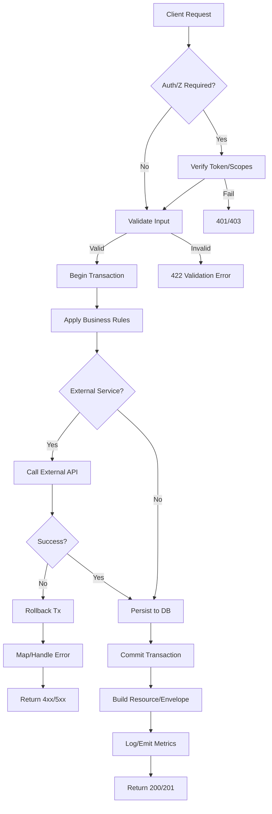

## API Name

Purpose: [Briefly explain what this API does and why it exists]

### General Information
- **Owner**: [team/assignee]
- **Version**: v[1]
- **Status**: draft | ready | deprecated
- **Audience**: backend dev | frontend dev | QA | customer
- **Related epic/ticket**: [Jira/Issue]

---

## 1) Endpoint
- **Method**: GET | POST | PUT | PATCH | DELETE
- **Base URL**: https://api.[domain].com
- **Path**: /api/v1/[resource]
- **Environment**: dev | staging | prod
- **Auth**: None | Bearer JWT | API Key | Sanctum | Cookie Session
- **Required Scope/Role**: [e.g., user, staff, admin]
- **Idempotency**: [e.g., Idempotency-Key header for POST]
- **Rate limiting**: [e.g., 60 req/minute]
- **Caching**: [e.g., Cache-Control, ETag]

#### Headers
| Name | Required | Example | Description |
|------|----------|---------|-------------|
| Authorization | Yes | Bearer <token> | User authentication |
| Content-Type | Yes | application/json | Payload format |

#### Path Params
| Name | Type | Required | Example | Description |
|------|------|----------|---------|-------------|
| id | string/uuid/int | Yes | 123 | Resource identifier |

#### Query Params
| Name | Type | Required | Default | Example | Description |
|------|------|----------|---------|---------|-------------|
| page | int | No | 1 | 2 | Pagination page |
| per_page | int | No | 20 | 50 | Items per page |
| sort | string | No | - | created_at:desc | Sorting |

#### Request Body Schema
Describe JSON structure: fields, data types, and constraints.

```json
{
  "name": "string [1..255] (required)",
  "email": "email (required, unique)",
  "age": "integer >= 0 (optional)",
  "tags": ["string"],
  "meta": {"key": "value"}
}
```

Detailed validation:
- name: required, string, 1..255
- email: required, email, unique
- age: optional, integer, min 0

Sample request:
```bash
curl -X POST "https://api.example.com/api/v1/users" \
  -H "Authorization: Bearer <token>" \
  -H "Content-Type: application/json" \
  -d '{
    "name": "Nguyen Van A",
    "email": "a@example.com",
    "age": 28,
    "tags": ["vip","beta"],
    "meta": {"note": "first order"}
  }'
```

---

## 2) Response

#### Error envelope (common)
```json
{
  "success": false,
  "message": "Short error description",
  "code": "ERROR_CODE",
  "errors": {
    "field": ["message 1", "message 2"]
  },
  "trace_id": "uuid"
}
```

#### 200/201 Success
Schema: [describe fields, types, nullability, enums]

Example:
```json
{
  "success": true,
  "data": {
    "id": 123,
    "name": "Nguyen Van A",
    "email": "a@example.com",
    "created_at": "2025-10-30T12:34:56Z"
  },
  "meta": {
    "pagination": {
      "page": 1,
      "per_page": 20,
      "total": 120
    }
  }
}
```

#### Common error codes
| HTTP | Internal code | When it happens | Frontend handling |
|------|---------------|-----------------|-------------------|
| 400 | VALIDATION_ERROR | Invalid parameters | Show field errors |
| 401 | UNAUTHORIZED | Missing/invalid token | Redirect to login |
| 403 | FORBIDDEN | Insufficient permissions | Show permission error |
| 404 | NOT_FOUND | Resource not found | Show empty state |
| 409 | CONFLICT | Conflict state | Retry or choose alternative |
| 422 | UNPROCESSABLE | Business rule violation | Show specific message |
| 429 | TOO_MANY_REQUESTS | Rate limit exceeded | Show retry-after |
| 500 | INTERNAL_ERROR | Server error | Retry / contact support |

I18n/Localization: [Are messages localized?]

---

## 3) Flow Logic
- Step 1: [Receive request, validate]
- Step 2: [Apply business rules]
- Step 3: [DB read/write within transaction]
- Step 4: [Call external services if any]
- Step 5: [Log/metrics]
- Step 6: [Return response]

Pseudo code (optional):
```text
if (!authorized(request)) return 401
validate(request)
begin transaction
  upsert domain models
  append status history
commit
publish events
return 200 with resource
```
 
 Diagram (optional): link to BPMN/sequence diagram if available.

Mermaid Flow (Business Chart):
This section is mandatory for all API specs.


---

## 4) Database Impact
- Primary tables: [table_a] (INSERT/UPDATE/DELETE?)
- Related tables: [table_b] (FOREIGN KEY to ...)
- History/tracking: [table_history]
- Indexes: [indexes needed for filtering/sorting]
- Transactions: [yes/no], isolation level
- Constraints: unique, not null, check constraints

Related migration(s): [link to migration files]

---

## 5) Integrations & External Effects
- Internal services: [PaymentService, NotificationService]
- External services: [VNPAY, Email/Mailgun]
- Emitted events: [event name, payload]
- Webhook (if any): URL, secret, retry, backoff

---

## 6) Security
- Auth/Z: method, scopes, roles
- Sensitive data: [masking/logging rules]
- Anti-replay/CSRF: [idempotency, CSRF token]
- Input hardening: [size limits, allowlist, sanitization]
- Rate limit/quota: [description]

---

## 7) Observability (Logging/Monitoring)
- Logs: levels, message keys, trace_id
- Metrics: latency, error rate, throughput
- Alerts: thresholds, escalation contacts

---

## 8) Performance & Scalability
- Expected QPS: [..]
- Timeout: [..]
- Batch/bulk: [..]
- Caching strategy: [client/server]

---

## 9) Edge Cases & Business Rules
- List edge cases and expected behavior
- Key business rules (invariants)

---

## 10) Testing
- Main cases: happy path, invalid params, edge cases, auth, permissions
- Postman/cURL snippets: include dev/staging environment
- Related unit/feature tests: [paths to tests]

Quick cURL example:
```bash
curl -H "Authorization: Bearer <token>" \
  "https://api.example.com/api/v1/resource?page=1&per_page=20"
```

Frontend example (fetch):
```javascript
const res = await fetch('/api/v1/resource', {
  method: 'GET',
  headers: { Authorization: `Bearer ${token}` }
});
const json = await res.json();
```

PHP example (Guzzle):
```php
$client = new \GuzzleHttp\Client(['base_uri' => 'https://api.example.com']);
$response = $client->post('/api/v1/users', [
    'headers' => [
        'Authorization' => 'Bearer '.$token,
        'Content-Type' => 'application/json'
    ],
    'json' => [
        'name' => 'Nguyen Van A',
        'email' => 'a@example.com'
    ]
]);
```

---

## 11) Versioning & Deprecation
- Versioning strategy: path vs header
- Deprecation plan: date, communication, fallback

---

## 12) Changelog
- [YYYY-MM-DD] [Change] – [author]

---

## 13) OpenAPI/Swagger Mapping
- Reference: [swagger-ui/json link]
- Component schema: [schema name]

---

## 14) Completion Checklist
- [ ] Endpoint, method, auth, headers clear
- [ ] Request schema + validation complete
- [ ] Response schema + standard error codes
- [ ] Flow logic + business rules documented
- [ ] Database impact (tables, indexes, transactions)
- [ ] Security, rate limit, idempotency
- [ ] Logging/metrics/alerts
- [ ] Performance, caching, pagination/sort/filter
- [ ] Test cases and FE integration examples
- [ ] OpenAPI mapping updated


