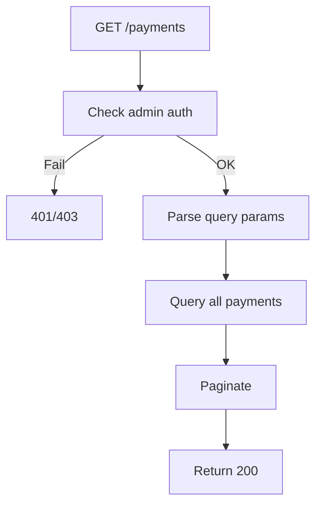

## API Name
Admin: List All Payments (GET /api/v1/payments)

Purpose: Admin/staff can query all payment transactions in system, not just their own. Extra filters, audit, and data exposure. (In production, usually a dedicated /admin/payments; for hackathon, use same with admin role check.)

### General Information
- **Owner**: backend/admin
- **Version**: v1
- **Status**: ready
- **Audience**: admin, finance, support
---
## 1) Endpoint
- **Method**: GET
- **Base URL**: https://api.example.com
- **Path**: /api/v1/payments
- **Auth**: Bearer <admin_token> (admin only)
 - **Caching**: None (admin data is dynamic and sensitive)

#### Headers
| Name           | Required | Example         | Description          |
|----------------|----------|-----------------|----------------------|
| Authorization  | Yes      | Bearer <token>  | Must be an admin     |
| Content-Type   | No       | application/json| Request format       |

#### Query Params
| Name          | Type   | Required | Example     | Description                         |
|---------------|--------|----------|-------------|-------------------------------------|
| status        | string | No       | completed   | Filter by status (pending,completed,failed,refunded) |
| payment_method| string | No       | vnpay       | Filter by method (vnpay, card, etc.)|
| user_id      | int    | No       | 512         | Filter payments by user/customer    |
| page          | int    | No       | 1           | Pagination page                     |
| per_page      | int    | No       | 15          | Items per page                      |

---
## 2) Response
Same as user, but can see all payments across users. May include sensitive data (PII redacted if needed).
---
## 3) Flow Logic
- Verify admin
- Parse all filters
- Query all payments
- Paginate
- Return envelope

**Mermaid Flowchart:**

---
## 4) Database Impact
- payments (select all)
---
## 5) Security
- Only admin permitted
---
## 6) Observability
- Log admin access, queries
---
## 7) Performance
Paginated
---
## 8) Edge Cases
Big data, slow query
---
## 9) Testing
- Large result feeds, access denied to non-admin
---
## 10) Versioning
v1
---
## 11) Changelog
2025-10-30 admin version
---
## 12) OpenAPI/Swagger Mapping
PaymentResource
---
## 13) Completion Checklist
[x] Admin query, user_id filter, audit, mermaid
