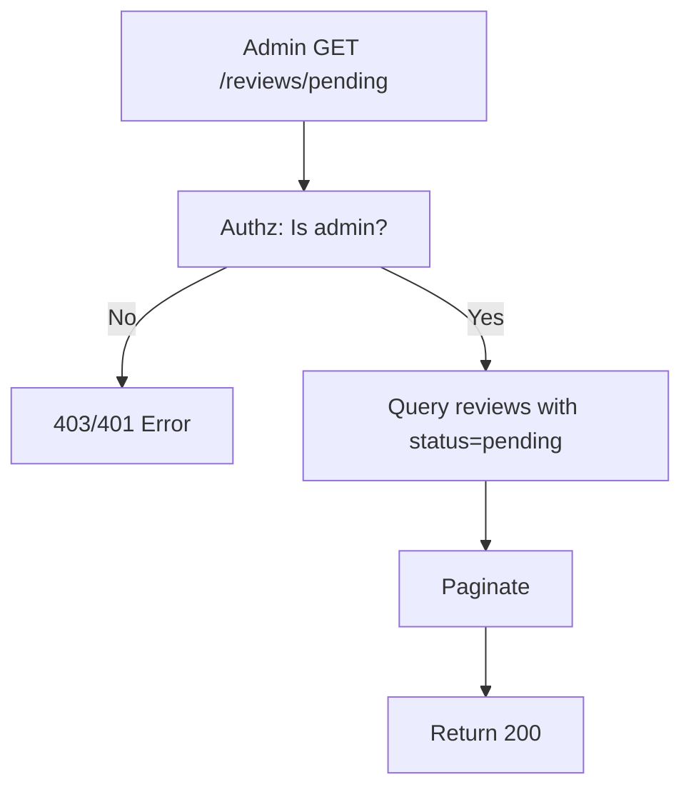

## API Name
Review: List Pending Reviews (Admin, GET /api/v1/reviews/pending)

Purpose: Lets an admin or moderator list reviews submitted by users but not yet approved. Used for moderation queue.

### General Information
- **Owner**: backend
- **Version**: v1
- **Status**: ready
- **Audience**: admin | backend dev | QA
- **Related epic/ticket**: [TBD]
---
## 1) Endpoint
- **Method**: GET
- **Base URL**: https://api.example.com
- **Path**: /api/v1/reviews/pending
- **Auth**: Required (Bearer token / Sanctum, role: admin)
- **Rate limiting**: 60 req/minute
 - **Caching**: None (moderation queue changes frequently)

#### Headers
| Name           | Required | Example | Description         |
|----------------|----------|---------|---------------------|
| Authorization  | Yes      | Bearer <token> | Admin authentication |
| Content-Type   | No       | application/json | Request format    |

#### Path Params
N/A
#### Query Params
N/A
#### Request Body Schema
N/A
---
## 2) Response
#### Standard error envelope
```json
{
  "success": false,
  "message": "Forbidden or error description",
  "code": "ERROR_CODE",
  "errors": {},
  "trace_id": "uuid"
}
```
#### 200 Success Example
```json
{
  "success": true,
  "data": [
    {"id":433, "booking_id":2224, "rating":5, "comment":"...", "status":"pending", ...}, ...
  ],
  "meta": { "pagination": { "page": 1, "per_page": 15, "total": 14 } }
}
```
#### Common Error Codes
| HTTP | Internal code    | When it happens      | Frontend handling |
|------|------------------|----------------------|-------------------|
| 401  | UNAUTHORIZED     | Not logged in        | Prompt admin login|
| 403  | FORBIDDEN        | Not admin/authz      | Show error msg    |
| 500  | INTERNAL_ERROR   | Server error         | Retry/support     |
---
## 3) Flow Logic
- Authenticate user and check admin role
- Query DB for reviews with status = pending
- Paginate and return

**Mermaid Flowchart:**

---
## 4) Database Impact
- Table: reviews (SELECT WHERE status=pending, paginated)
---
## 5) Integrations & External Effects
None
---
## 6) Security
- Admin role required, fully authenticated
---
## 7) Observability (Logging/Monitoring)
- Log admin moderation
---
## 8) Performance & Scalability
- Moderate queue lengths, paginated
---
## 9) Edge Cases & Business Rules
- No pending = empty list
---
## 10) Testing
- Non-admin, no auth, has/no pending
- Example:
```bash
curl -H "Authorization: Bearer <token>" "https://api.example.com/api/v1/reviews/pending"
```
---
## 11) Versioning & Deprecation
- v1
---
## 12) Changelog
- [2025-10-30] Initial admin version
---
## 13) OpenAPI/Swagger Mapping
- Component: ReviewResource, ApiEnvelope
---
## 14) Completion Checklist
- [x] Endpoint/admin only
- [x] Schema/errors
- [x] Mermaid chart
- [x] DB impact
- [x] Security
- [x] Logging/metrics
- [x] Test/FE example
- [x] OpenAPI mapping
