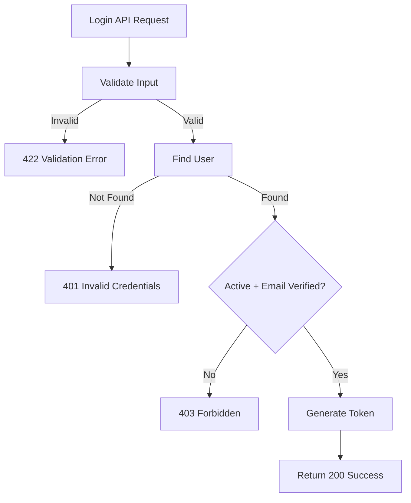

## API Name
Auth: User Login (POST /api/v1/auth/login)

Purpose: Authenticates a user and returns an access token (Bearer) and user information.

### General Information
- **Owner**: backend
- **Version**: v1
- **Status**: ready
- **Audience**: backend dev | frontend dev | QA | customer
- **Related epic/ticket**: [TBD]

---
## 1) Endpoint
- **Method**: POST
- **Base URL**: https://api.example.com
- **Path**: /api/v1/auth/login
- **Environment**: dev | staging | prod
- **Auth**: None
- **Rate limiting**: 60 req/minute

#### Headers
| Name          | Required | Example          | Description        |
|---------------|----------|------------------|--------------------|
| Content-Type  | Yes      | application/json | Request body format |

#### Request Body Schema
```json
{
  "email": "user@example.com",
  "password": "string >= 8"
}
```
- `email`: required, email
- `password`: required, string, min 8 characters

#### Path Params
N/A

#### Query Params
N/A

---
## 2) Response
#### Error Envelope (common)
```json
{
  "success": false,
  "message": "Short error description",
  "code": "ERROR_CODE",
  "errors": {},
  "trace_id": "uuid"
}
```

#### 200 Success Example
```json
{
  "success": true,
  "data": {
    "user": {
      "id": 123,
      "name": "John Doe",
      "email": "user@example.com",
      "phone": null,
      "avatar": null,
      "language_preference": "en",
      "is_admin": false
    },
    "token": "<token>",
    "token_type": "Bearer"
  }
}
```
#### Common Error Codes
| HTTP | Internal code       | When it happens           | Frontend handling           |
|------|---------------------|---------------------------|-----------------------------|
| 400/401 | INVALID_CREDENTIALS | Wrong login info      | Show login error            |
| 403  | ACCOUNT_INACTIVE     | Account is locked         | Message, ask for support    |
| 403  | EMAIL_NOT_VERIFIED   | Email not verified        | Prompt for email OTP        |
| 500  | INTERNAL_ERROR       | Server error              | Retry or contact support    |

---
## 3) Flow Logic
- Receive request (`email`, `password`)
- Retrieve user, verify password
- Check if user active and email verified
- Issue access token and return user data

**Mermaid Flowchart:**

---
## 4) Database Impact
- Table: users (SELECT/UPDATE last_login_at)
---
## 5) Integrations & External Effects
None
---
## 6) Security
- Always use HTTPS
- Login lockout policy recommended on repeated failure
---
## 7) Observability (Logging/Monitoring)
- Log failed login attempts
---
## 8) Performance & Scalability
- Stateless per-request login
---
## 9) Edge Cases & Business Rules
- Unverified email cannot log in
- Inactive/locked users cannot log in
---
## 10) Testing
- Happy path, wrong password, user not found, locked user, unverified email
- Example:
```bash
curl -X POST "https://api.example.com/api/v1/auth/login" -H "Content-Type: application/json" -d '{"email":"a@example.com","password":"12345678"}'
```

---
## 11) Versioning & Deprecation
- v1
---
## 12) Changelog
- [2025-10-30] Initial version – AI generated, ENGLISH
---
## 13) OpenAPI/Swagger Mapping
- Component: ApiEnvelope
---
## 14) Completion Checklist
- [x] Endpoint clear
- [x] Request schema + validation
- [x] Response schema + error codes
- [x] Flow logic described
- [x] DB impact
- [x] Security docs
- [x] Logging/metrics
- [x] Performance notes
- [x] Test/FE example
- [x] OpenAPI mapping
