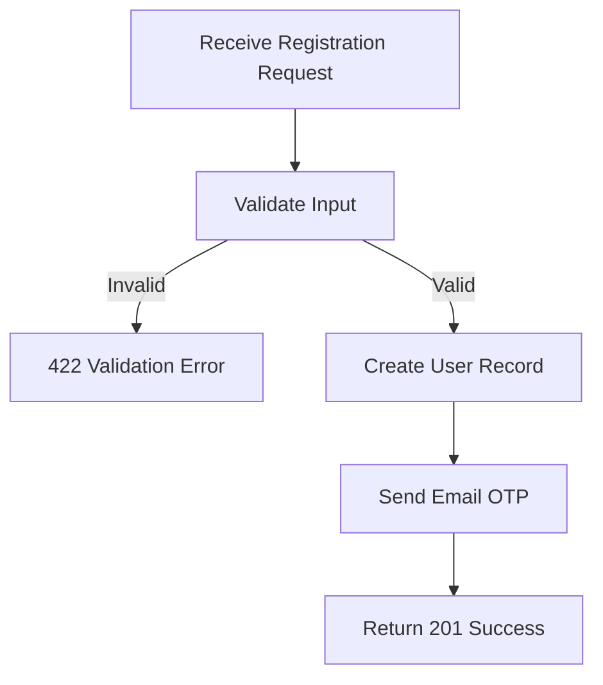

## API Name
Auth: User Registration (POST /api/v1/auth/register)

Purpose: Register a new account. Sends email OTP for verification. Returns basic user info and onboarding instructions.

### General Information
- **Owner**: backend
- **Version**: v1
- **Status**: ready
- **Audience**: backend dev | frontend dev | QA | customer
- **Related epic/ticket**: [TBD]

---
## 1) Endpoint
- **Method**: POST
- **Base URL**: https://api.example.com
- **Path**: /api/v1/auth/register
- **Environment**: dev | staging | prod
- **Auth**: None
- **Rate limiting**: 60 req/minute

#### Headers
| Name          | Required | Example          | Description        |
|---------------|----------|------------------|--------------------|
| Content-Type  | Yes      | application/json | Request body format |

#### Request Body Schema
```json
{
  "name": "string (1-255, required)",
  "email": "user@example.com (required, unique)",
  "password": "string (min 8, required)",
  "password_confirmation": "string (match password)",
  "phone": "string (optional)",
  "language_preference": "en|vi|ja|zh (optional)"
}
```
- `name`: required, string (1-255)
- `email`: required, valid email, unique
- `password`: required, string, min 8, confirmed
- `password_confirmation`: must match password
- `phone` (optional)
- `language_preference` (optional)

#### Path Params
N/A

#### Query Params
N/A
---
## 2) Response
#### Error Envelope (common)
```json
{
  "success": false,
  "message": "Short error description",
  "code": "ERROR_CODE",
  "errors": {},
  "trace_id": "uuid"
}
```
#### 201 Success Example
```json
{
  "success": true,
  "data": {
    "user": {
      "id": 234,
      "name": "New User",
      "email": "newuser@example.com",
      "phone": null,
      "language_preference": "en",
      "email_verified_at": null
    },
    "message": "Registration successful. Please verify your email."
  }
}
```
#### Common Error Codes
| HTTP | Internal code       | When it happens           | Frontend handling           |
|------|---------------------|---------------------------|-----------------------------|
| 422  | VALIDATION_ERROR    | Input data invalid        | Show field error            |
| 409  | EMAIL_EXISTS        | Email already registered  | Display account message     |
| 500  | INTERNAL_ERROR      | Server error              | Retry or contact support    |

---
## 3) Flow Logic
- Validate input (name, email, password...)
- Create user in database
- Auto-send email OTP
- Respond with minimal user info, onboarding message

**Mermaid Flowchart:**

---
## 4) Database Impact
- Table: users (INSERT)
---
## 5) Integrations & External Effects
- Email system (OTP for email verification)
---
## 6) Security
- Always use HTTPS
- Strong password recommended
---
## 7) Observability (Logging/Monitoring)
- Log registration success/errors
---
## 8) Performance & Scalability
- Simple signup. Email delivery async recommended for scale.
---
## 9) Edge Cases & Business Rules
- Email must be unique
- Strong password enforced
---
## 10) Testing
- Happy path, missing fields, invalid email, weak password, duplicate email
- Example:
```bash
curl -X POST "https://api.example.com/api/v1/auth/register" -H "Content-Type: application/json" -d '{"name":"New User","email":"newuser@example.com","password":"12345678","password_confirmation":"12345678"}'
```

---
## 11) Versioning & Deprecation
- v1
---
## 12) Changelog
- [2025-10-30] Initial version – AI generated, ENGLISH
---
## 13) OpenAPI/Swagger Mapping
- Component: ApiEnvelope
---
## 14) Completion Checklist
- [x] Endpoint clear
- [x] Request schema + validation
- [x] Response schema + error codes
- [x] Flow logic described
- [x] DB impact
- [x] Security docs
- [x] Logging/metrics
- [x] Performance notes
- [x] Test/FE example
- [x] OpenAPI mapping
