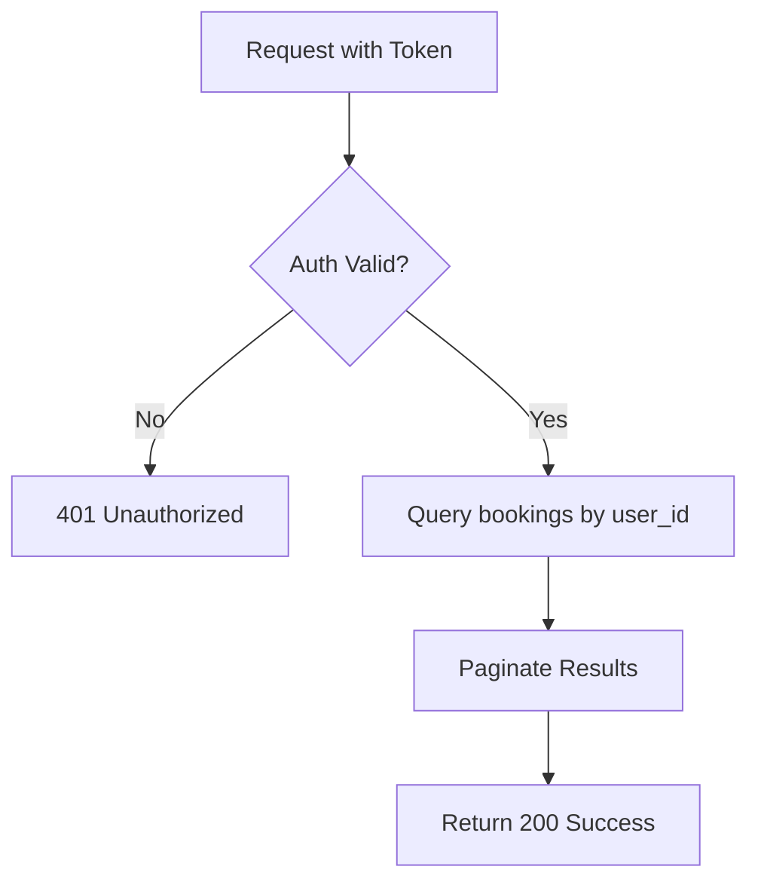

## API Name
Booking: List My Bookings (GET /api/v1/my-bookings)

Purpose: Authenticated user retrieves their own bookings, paginated. Results are filtered by user and may include branch/service/staff info.

### General Information
- **Owner**: backend
- **Version**: v1
- **Status**: ready
- **Audience**: backend dev | frontend dev | QA | customer
- **Related epic/ticket**: [TBD]
---
## 1) Endpoint
- **Method**: GET
- **Base URL**: https://api.example.com
- **Path**: /api/v1/my-bookings
- **Auth**: Bearer token required
- **Rate limiting**: 60 req/minute

#### Headers
| Name           | Required | Example            | Description           |
|----------------|----------|--------------------|-----------------------|
| Authorization  | Yes      | Bearer <token>     | User authentication   |
| Content-Type   | No       | application/json   | Request format        |

#### Query Params
| Name      | Type | Required | Default | Example | Description         |
|-----------|------|----------|---------|---------|---------------------|
| page      | int  | No       | 1       | 2       | Pagination page     |
| per_page  | int  | No       | 15      | 50      | Items per page      |

#### Path Params
N/A
#### Request Body Schema
N/A
---
## 2) Response
#### Standard error envelope
```json
{
  "success": false,
  "message": "Short error description",
  "code": "ERROR_CODE",
  "errors": {},
  "trace_id": "uuid"
}
```
#### 200 Success Example
```json
{
  "success": true,
  "data": [
    { ...booking object... }, ...
  ],
  "meta": { "pagination": { "page": 1, "per_page": 15, "total": 31 } }
}
```
#### Common Error Codes
| HTTP | Internal code      | When it happens            | Frontend handling   |
|------|--------------------|----------------------------|---------------------|
| 401  | UNAUTHORIZED       | Not logged in              | Prompt login        |
| 500  | INTERNAL_ERROR     | Server error               | Retry/support       |

---
## 3) Flow Logic
- Authenticate request
- Fetch bookings filtered by current user
- Paginate & return result with meta info

**Mermaid Flowchart:**

---
## 4) Database Impact
- Table: bookings (SELECT with user_id + pagination)
---
## 5) Integrations & External Effects
None
---
## 6) Security
- Auth required, only user's own bookings visible
---
## 7) Observability (Logging/Monitoring)
- Normal application logs
---
## 8) Performance & Scalability
- Index on user_id
---
## 9) Edge Cases & Business Rules
- User with no bookings gets empty list
---
## 10) Testing
- New/no user, multiple pages, unauthorized
- Example:
```bash
curl "https://api.example.com/api/v1/my-bookings?per_page=10" -H "Authorization: Bearer <token>"
```
---
## 11) Versioning & Deprecation
- v1
---
## 12) Changelog
- [2025-10-30] Initial version – ENGLISH
---
## 13) OpenAPI/Swagger Mapping
- Component: BookingResource, ApiEnvelope
---
## 14) Completion Checklist
- [x] Endpoint clear
- [x] Request schema & validation
- [x] Response schema & error codes
- [x] Flow logic documented
- [x] DB impact
- [x] Security
- [x] Logging/metrics
- [x] Test/FE example
- [x] OpenAPI mapping
