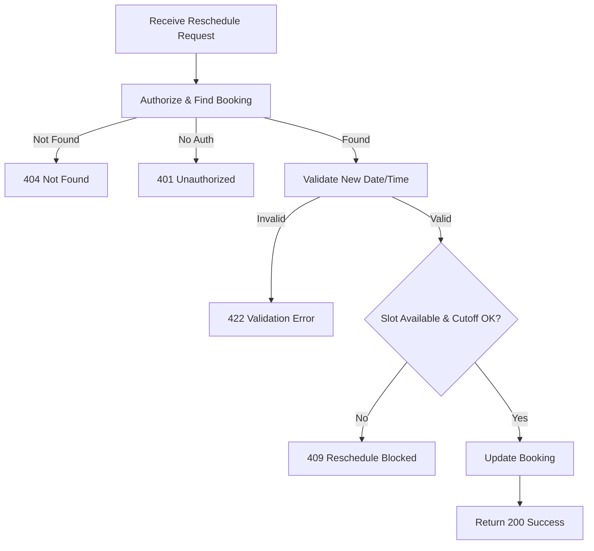

## API Name
Booking: Reschedule Booking (POST /api/v1/bookings/{id}/reschedule)

Purpose: Authenticated users can reschedule an existing booking to a new date/time (and optionally staff).

### General Information
- **Owner**: backend
- **Version**: v1
- **Status**: ready
- **Audience**: backend dev | frontend dev | QA | customer
- **Related epic/ticket**: [TBD]
---
## 1) Endpoint
- **Method**: POST
- **Base URL**: https://api.example.com
- **Path**: /api/v1/bookings/{id}/reschedule
- **Auth**: Bearer token required
- **Rate limiting**: 60 req/minute

#### Headers
| Name           | Required | Example               | Description            |
|----------------|----------|----------------------|------------------------|
| Authorization  | Yes      | Bearer <token>       | User authentication    |
| Content-Type   | Yes      | application/json     | Request format         |

#### Path Params
| Name | Type | Required | Example | Description     |
|------|------|----------|---------|-----------------|
| id   | int  | Yes      | 11      | Booking ID      |

#### Request Body Schema
```json
{
  "booking_date": "YYYY-MM-DD (required, in future)",
  "booking_time": "HH:mm (required)",
  "staff_id": 510 (optional)
}
```
- Date/time must be in future and slot must be available

#### Query Params
N/A
---
## 2) Response
#### Standard Error Envelope
```json
{
  "success": false,
  "message": "Short error description",
  "code": "ERROR_CODE",
  "errors": {},
  "trace_id": "uuid"
}
```
#### 200 Success Example
```json
{
  "success": true,
  "data": {
    ...booking object updated...
    "booking_date": "2025-12-01",
    "booking_time": "15:30"
  }
}
```
#### Common Error Codes
| HTTP | Internal code      | When it happens          | Frontend handling   |
|------|--------------------|--------------------------|---------------------|
| 401  | UNAUTHORIZED       | Not logged in            | Prompt login        |
| 404  | NOT_FOUND          | Booking not exists       | Show error          |
| 422  | VALIDATION_ERROR   | Bad date/time, slot busy | Show error/field    |
| 409  | RESCHEDULE_BLOCKED | After cutoff/not allowed | Explain restriction |

---
## 3) Flow Logic
- Authorize user, lookup booking
- Validate new date/time (must be in the future/cutoff respected)
- Check time slot availability
- Update date/time/staff, update status as needed
- Return updated booking

**Mermaid Flowchart:**

---
## 4) Database Impact
- Table: bookings (UPDATE)
---
## 5) Integrations & External Effects
- User/staff notification, optional.
---
## 6) Security
- Only allowed before cutoff/time/event started
---
## 7) Observability (Logging/Monitoring)
- Log reschedule attempts/errors
---
## 8) Performance & Scalability
- Direct update
---
## 9) Edge Cases & Business Rules
- Enforce cutoff windows (ex: cannot change within 4 hours of event)
---
## 10) Testing
- Before/after cutoff, slot available/busy, bad date, missing permissions
- cURL:
```bash
curl -X POST "https://api.example.com/api/v1/bookings/12/reschedule" \
  -H "Authorization: Bearer <token>" \
  -H "Content-Type: application/json" \
  -d '{"booking_date":"2025-12-01","booking_time":"15:30"}'
```
---
## 11) Versioning & Deprecation
- v1
---
## 12) Changelog
- [2025-10-30] Initial version – ENGLISH
---
## 13) OpenAPI/Swagger Mapping
- Component: BookingResource, ApiEnvelope
---
## 14) Completion Checklist
- [x] Endpoint clear
- [x] Request schema & validation
- [x] Response schema & error codes
- [x] Flow logic documented
- [x] DB impact
- [x] Security
- [x] Logging/metrics
- [x] Test/FE example
- [x] OpenAPI mapping
