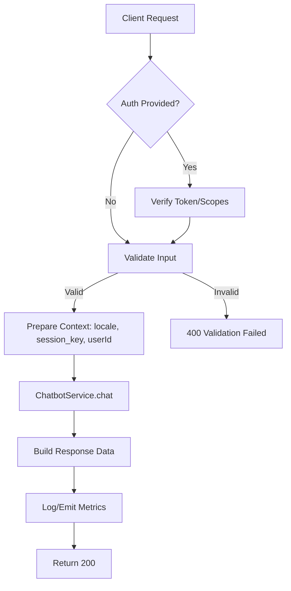

## Chatbot - Send Message

Purpose: Send a user message to the AI chatbot and receive a generated response. Supports both authenticated users and guests (via session key).

### General Information
- **Owner**: backend
- **Version**: v1
- **Status**: ready
- **Audience**: backend dev | frontend dev | QA
- **Related epic/ticket**: -

---

## 1) Endpoint
- **Method**: POST
- **Base URL**: https://api.[domain].com
- **Path**: /api/v1/chatbot
- **Environment**: dev | staging | prod
- **Auth**: None | Bearer JWT
- **Required Scope/Role**: -
- **Idempotency**: Not required
- **Rate limiting**: 60 req/minute
- **Caching**: None

#### Headers
| Name | Required | Example | Description |
|------|----------|---------|-------------|
| Authorization | No | Bearer <token> | Optional; associates message to authenticated user |
| Content-Type | Yes | application/json | Payload format |
| X-Chat-Session | No | 3f8a1b3e-... | Optional guest session key (alternative to body) |

#### Path Params
| Name | Type | Required | Example | Description |
|------|------|----------|---------|-------------|

#### Query Params
| Name | Type | Required | Default | Example | Description |
|------|------|----------|---------|---------|-------------|

#### Request Body Schema
```json
{
  "message": "string [1..1000] (required)",
  "session_key": "string [..191] (optional)"
}
```

Detailed validation:
- message: required, string, min 1, max 1000
- session_key: optional, string, max 191

Sample request:
```bash
curl -X POST "https://api.example.com/api/v1/chatbot" \
  -H "Content-Type: application/json" \
  -H "Authorization: Bearer <token>" \
  -H "X-Chat-Session: 3f8a1b3e-0c6f-4b1a-9f3a-8b1e2d7f9c21" \
  -d '{
    "message": "Tôi muốn biết thông tin về dịch vụ chăm sóc da"
  }'
```

---

## 2) Response

#### Error envelope (common)
```json
{
  "success": false,
  "message": "Short error description",
  "error": { "type": "ERROR_TYPE", "code": "ERROR_CODE", "details": {"field": ["message"]} },
  "trace_id": "uuid",
  "timestamp": "2025-10-31T12:34:56Z"
}
```

#### 200 Success
Schema:
- success: boolean
- message: string
- data: object
  - message: string (AI answer)
  - user_id: integer|null
  - locale: string
- meta: object|null
- trace_id: string
- timestamp: ISO datetime

Example:
```json
{
  "success": true,
  "message": "Response generated successfully",
  "data": {
    "message": "Chúng tôi cung cấp các dịch vụ chăm sóc da...",
    "user_id": 1,
    "locale": "vi"
  },
  "meta": null,
  "trace_id": "b2f3e7a1-6a40-4b78-9e10-9b2f5a4d9c11",
  "timestamp": "2025-10-31T12:34:56Z"
}
```

#### Common error codes
| HTTP | Internal code | When it happens | Frontend handling |
|------|---------------|-----------------|-------------------|
| 400 | VALIDATION_FAILED | Payload invalid | Show field errors |
| 401 | UNAUTHORIZED | Missing/invalid token (if sending Authorization) | Prompt login |
| 429 | RATE_LIMIT_EXCEEDED | Rate limit exceeded | Show retry-after |
| 500 | INTERNAL_ERROR | Server error | Retry / contact support |

I18n/Localization: Localized messages via `SetLocale` middleware and translation keys.

---

## 3) Flow Logic
- Step 1: Receive request, validate via `ChatRequest`
- Step 2: Resolve locale (`app()->getLocale()`)
- Step 3: Get `userId` if authenticated; obtain `session_key` from body or `X-Chat-Session`
- Step 4: Call `ChatbotServiceInterface::chat(message, locale, userId, sessionKey)`
- Step 5: Return standardized envelope with data and trace_id

Mermaid Flow:


---

## 4) Database Impact
- Primary tables: `chat_sessions` (SELECT/UPSERT via service), `chat_messages` (possible INSERT via service)
- Related tables: users (`user_id`)
- History/tracking: message history per session
- Indexes: session_key unique or indexed; foreign keys to user/session
- Transactions: dependent on service implementation
- Constraints: session_key length <= 191, non-null constraints per schema

Related migration(s): refer to `database/migrations/*chat*`

---

## 5) Integrations & External Effects
- Internal services: `ChatbotServiceInterface`
- External services: LLM provider (if any; not specified)
- Emitted events: -
- Webhook: -

---

## 6) Security
- Auth/Z: Optional Bearer JWT
- Sensitive data: mask PII in logs; avoid logging raw messages when unnecessary
- Anti-replay/CSRF: Not applicable (JSON API); idempotency not required
- Input hardening: message size limits enforced by validation
- Rate limit/quota: 60 req/min per IP/key

---

## 7) Observability (Logging/Monitoring)
- Logs: request trace via `trace_id`; log error type and code on failures
- Metrics: latency, error rate, throughput
- Alerts: error rate/latency thresholds on chatbot endpoint

---

## 8) Performance & Scalability
- Expected QPS: depends on traffic; covered by throttle 60/min
- Timeout: align with LLM/service timeouts
- Batch/bulk: not applicable
- Caching strategy: none

---

## 9) Edge Cases & Business Rules
- Empty or overly long message → validation error
- Guest without `session_key` → new session may be created by service
- Authenticated user → session associated to user
- Locale affects response language

---

## 10) Testing
- Main cases: happy path, invalid `message`, with/without `Authorization`, with/without `session_key`
- cURL example: see above
- Related unit/feature tests: add under `tests/Feature/Api/V1/ChatbotTest.php`

Quick cURL example:
```bash
curl -X POST "https://api.example.com/api/v1/chatbot" \
  -H "Content-Type: application/json" \
  -d '{"message":"Hello"}'
```

Frontend example (fetch):
```javascript
const res = await fetch('/api/v1/chatbot', {
  method: 'POST',
  headers: { 'Content-Type': 'application/json', Authorization: `Bearer ${token}` },
  body: JSON.stringify({ message, session_key })
});
const json = await res.json();
```

---

## 11) Versioning & Deprecation
- Versioning strategy: path-based (`/api/v1/...`)
- Deprecation plan: none

---

## 12) Changelog
- [2025-10-31] Initial spec – author

---

## 13) OpenAPI/Swagger Mapping
- Reference: included via `@OA\Post(path="/api/v1/chatbot")` in `App\Http\Controllers\Api\V1\ChatbotController`
- Component schema: response envelope `ApiEnvelope`

---

## 14) Completion Checklist
- [x] Endpoint, method, auth, headers clear
- [x] Request schema + validation complete
- [x] Response schema + standard error codes
- [x] Flow logic + business rules documented
- [x] Database impact (tables, indexes, transactions)
- [x] Security, rate limit, idempotency
- [x] Logging/metrics/alerts
- [x] Performance, caching
- [x] Test cases and FE integration examples
- [x] OpenAPI mapping updated


