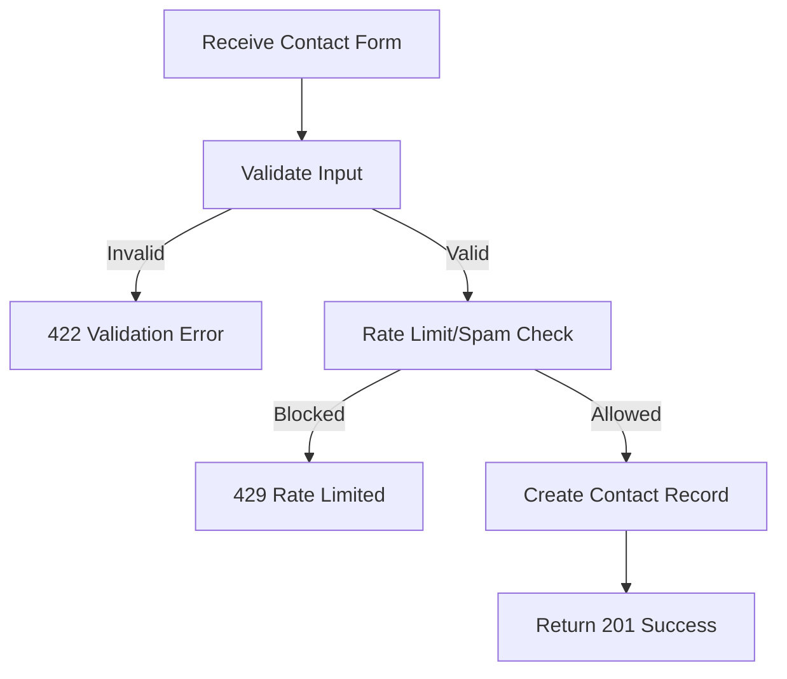

## API Name
Contact: Create Contact Submission (POST /contact)

Purpose: Allows a user to submit a message, inquiry, complaint, or suggestion via the public contact form.

### General Information
- **Owner**: backend
- **Version**: v1
- **Status**: ready
- **Audience**: user | Q&A | customer | frontend dev
- **Related epic/ticket**: [TBD]
---
## 1) Endpoint
- **Method**: POST
- **Base URL**: https://api.example.com
- **Path**: /api/v1/contact
- **Auth**: None (public)
- **Rate limiting**: 10 req/hour/IP

#### Headers
| Name         | Required | Example            | Description        |
|--------------|----------|--------------------|--------------------|
| Content-Type | Yes      | application/json   | Request format     |

#### Request Body Schema
```json
{
  "name": "string, required, max 255",
  "email": "string, required, email",
  "phone": "string, optional, max 20",
  "subject": "string, required, max 255",
  "message": "string, required, max 2000",
  "type": "general | inquiry | complaint | suggestion (optional)"
}
```
- All fields are required except phone/type

#### Path Params
N/A
#### Query Params
N/A
---
## 2) Response
#### Standard error envelope
```json
{
  "success": false,
  "message": "Short error description",
  "code": "ERROR_CODE",
  "errors": {},
  "trace_id": "uuid"
}
```
#### 201 Success Example
```json
{
  "success": true,
  "data": {
    "id": 10012,
    "name": "Jane Doe",
    "email": "janedoe@example.com",
    "phone": "+84991234569",
    "subject": "Booking help",
    "message": "I have a problem ...",
    "type": "inquiry",
    "status": "new",
    "created_at": "2025-10-30T11:15:00Z"
  },
  "message": "Thank you for contacting us. We will respond soon."
}
```
#### Common Error Codes
| HTTP | Internal code      | When it happens          | Frontend handling   |
|------|--------------------|--------------------------|---------------------|
| 422  | VALIDATION_ERROR   | Required/invalid field   | Show error          |
| 429  | RATE_LIMITED       | Too often from IP/email  | Show cooldown       |
| 500  | INTERNAL_ERROR     | Server error             | Retry/support       |
---
## 3) Flow Logic
- User submits contact form JSON
- Input validated
- Create contact record with "new" status
- Return confirmation and created data

**Mermaid Flowchart:**

---
## 4) Database Impact
- Table: contact_submissions (INSERT)
---
## 5) Integrations & External Effects
- Optional: Email to admin/support notification
---
## 6) Security
- Rate limit/IP and bot/spam detection
---
## 7) Observability (Logging/Monitoring)
- Log submits and threshold/cooldown triggers
---
## 8) Performance & Scalability
- High-volume can persist to queue
---
## 9) Edge Cases & Business Rules
- Disallow spam/repeat
---
## 10) Testing
- Valid/happy path, miss/no required, spam repeat
- Example:
```bash
curl -X POST "https://api.example.com/api/v1/contact" -H "Content-Type: application/json" -d '{"name":"Jane Doe","email":"janedoe@example.com","subject":"Booking help","message":"..."}'
```
---
## 11) Versioning & Deprecation
- v1
---
## 12) Changelog
- [2025-10-30] Initial version – ENGLISH
---
## 13) OpenAPI/Swagger Mapping
- Component: ContactResource, ApiEnvelope
---
## 14) Completion Checklist
- [x] Endpoint clear
- [x] Request schema & validation
- [x] Response schema & error codes
- [x] Flow logic + mermaid chart documented
- [x] DB impact
- [x] Security
- [x] Logging/metrics
- [x] Test/FE example
- [x] OpenAPI mapping
