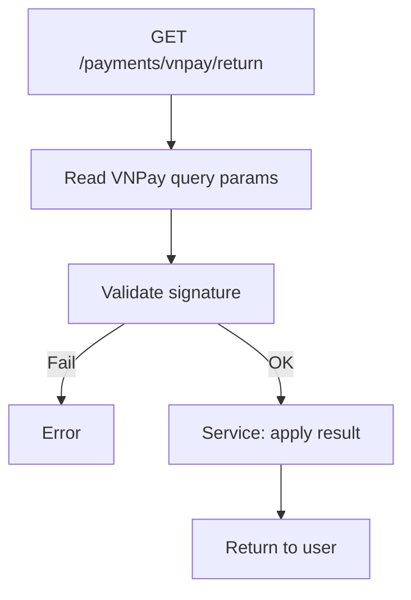

## API Name
Payment: VNPay Return Handler (GET /api/v1/payments/vnpay/return)

Purpose: VNPay redirects user/browser to this endpoint after payment attempt. Handles updating booking/payment, shows success or error page.

### General Information
- **Owner**: backend
- **Version**: v1
- **Status**: ready
- **Audience**: frontend | backend | QA | customer
---
## 1) Endpoint
- **Method**: GET
- **Base URL**: https://api.example.com
- **Path**: /api/v1/payments/vnpay/return
- **Auth**: None (public, user/guest both)

#### Headers
N/A

#### Query Params
| Name          | Type   | Required | Example     | Description                    |
|---------------|--------|----------|-------------|-------------------------------|
| vnp_...       | string/int | Yes | ...         | All VNPay required fields      |

#### Request Body Schema
N/A
---
## 2) Response
#### Error envelope
```json
{"success": false, "message": "Error", ...}
```
#### 200 Example
```json
{"success": true, "data": {"status":"completed","amount":99000,...}}
```
---
## 3) Flow Logic
- Accept query params from VNPay
- Call service to validate signature, process booking
- Return status/result

**Mermaid Flowchart:**

---
## 4) Database Impact
- bookings, payments: update status
---
## 5) Integrations & External Effects
- VNPay (incoming)
---
## 6) Security
- Signature verified
---
## 7) Observability (Logging/Monitoring)
- Log success/fail, trace_id
---
## 8) Performance & Scalability
- Quick
---
## 9) Edge Cases & Business Rules
- Stale/expired; double submit
---
## 10) Testing
- Example:
```bash
curl "https://api.example.com/api/v1/payments/vnpay/return?..."
```
---
## 11) Versioning & Deprecation
- v1
---
## 12) Changelog
- [2025-10-30] Initial version
---
## 13) OpenAPI/Swagger Mapping
- PaymentResource
---
## 14) Completion Checklist
[x] Flowchart, all fields, examples, error paths
