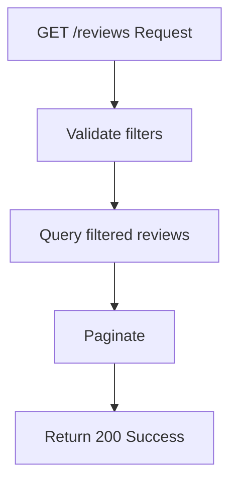

## API Name
Review: List Reviews (GET /api/v1/reviews)

Purpose: Returns a paginated, filterable list of user reviews for services/branches/staff. Public, no auth. Used for displaying resorts and review aggregation.

### General Information
- **Owner**: backend
- **Version**: v1
- **Status**: ready
- **Audience**: frontend dev | backend dev | QA | customer
- **Related epic/ticket**: [TBD]
---
## 1) Endpoint
- **Method**: GET
- **Base URL**: https://api.example.com
- **Path**: /api/v1/reviews
- **Auth**: None
- **Rate limiting**: 60 req/minute

#### Headers
| Name         | Required | Example          | Description        |
|--------------|----------|------------------|--------------------|
| Content-Type | No       | application/json | Request format     |

#### Query Params
| Name        | Type | Required | Example | Description                         |
|-------------|------|----------|---------|-------------------------------------|
| page        | int  | No       | 2       | Pagination page                     |
| per_page    | int  | No       | 10      | Items per page                      |
| service_id  | int  | No       | 5       | Filter by service ID                |
| branch_id   | int  | No       | 2       | Filter by branch ID                 |
| rating      | int  | No       | 5       | Filter by rating (1-5)              |

#### Path Params
N/A
#### Request Body Schema
N/A
---
## 2) Response
#### Standard error envelope
```json
{
  "success": false,
  "message": "Short error description",
  "code": "ERROR_CODE",
  "errors": {},
  "trace_id": "uuid"
}
```
#### 200 Success Example
```json
{
  "success": true,
  "data": [
    { "id":44, "service_id":5, "comment":"Nice!", "rating":4, "created_at": "2025-10-30T13:12:00Z", ... }, ...
  ],
  "meta": { "pagination": { "page": 2, "per_page": 10, "total": 98 } }
}
```
#### Common Error Codes
| HTTP | Internal code    | When it happens         | Frontend handling |
|------|------------------|-------------------------|-------------------|
| 400  | VALIDATION_ERROR | Invalid query params    | Show error        |
| 500  | INTERNAL_ERROR   | Server error            | Retry/support     |
---
## 3) Flow Logic
- Parse and validate filters
- Query reviews with filters/sort options
- Paginate and return envelope

**Mermaid Flowchart:**

---
## 4) Database Impact
- Table: reviews (SELECT with filters)
---
## 5) Integrations & External Effects
None
---
## 6) Security
- Public
---
## 7) Observability (Logging/Monitoring)
- Log usage/filters
---
## 8) Performance & Scalability
- Indexed queries for filters
---
## 9) Edge Cases & Business Rules
- Empty results if no reviews
---
## 10) Testing
- Filtering, paging, sorting
- Example:
```bash
curl "https://api.example.com/api/v1/reviews?service_id=5&rating=5&page=1"
```
---
## 11) Versioning & Deprecation
- v1
---
## 12) Changelog
- [2025-10-30] Initial version – ENGLISH
---
## 13) OpenAPI/Swagger Mapping
- Component: ReviewResource, ApiEnvelope
---
## 14) Completion Checklist
- [x] Endpoint clear
- [x] Request schema & validation
- [x] Response schema/error codes
- [x] Mermaid chart/logic
- [x] DB impact
- [x] Test/FE example
- [x] OpenAPI mapping
