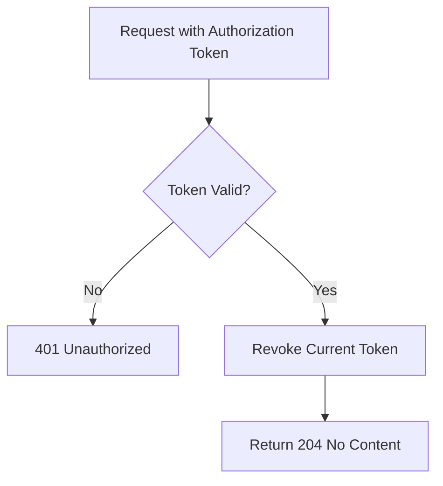

## API Name
Auth: Logout (POST /api/v1/auth/logout)

Purpose: Revokes access token for the current user (logout from this device/session).

### General Information
- **Owner**: backend
- **Version**: v1
- **Status**: ready
- **Audience**: backend dev | frontend dev | QA | customer
- **Related epic/ticket**: [TBD]

---
## 1) Endpoint
- **Method**: POST
- **Base URL**: https://api.example.com
- **Path**: /api/v1/auth/logout
- **Environment**: dev | staging | prod
- **Auth**: Bearer token / Sanctum required
- **Rate limiting**: 60 req/minute

#### Headers
| Name          | Required | Example               | Description             |
|---------------|----------|----------------------|-------------------------|
| Authorization | Yes      | Bearer <token>       | User authentication     |
| Content-Type  | Yes      | application/json     | Request body format     |

#### Path Params
N/A
#### Query Params
N/A
#### Request Body Schema
N/A
---
## 2) Response
#### Success (204 No Content)
- Logs out successfully. No response body (standard REST status).

#### Error Envelope
```json
{
  "success": false,
  "message": "Short error description",
  "code": "ERROR_CODE",
  "errors": {},
  "trace_id": "uuid"
}
```

#### Common Error Codes
| HTTP | Internal code       | When it happens                      | Frontend handling         |
|------|---------------------|--------------------------------------|---------------------------|
| 401  | UNAUTHORIZED        | No/invalid token                     | Redirect/login            |
| 500  | INTERNAL_ERROR      | Server error                         | Retry/support             |

---
## 3) Flow Logic
- Authenticate request token
- Revoke only the current session/token
- Respond with 204 status code

**Mermaid Flowchart:**

---
## 4) Database Impact
- Table: tokens (delete/revoke current token)
---
## 5) Integrations & External Effects
None
---
## 6) Security
- Requires valid auth token
---
## 7) Observability (Logging/Monitoring)
- Log logout events
---
## 8) Performance & Scalability
- Revocation is a fast write
---
## 9) Edge Cases & Business Rules
- Token already invalid = must respond 401
---
## 10) Testing
- Normal logout, logout with wrong/expired token, call with no token
- Example:
```bash
curl -X POST "https://api.example.com/api/v1/auth/logout" -H "Authorization: Bearer <token>"
```
---
## 11) Versioning & Deprecation
- v1
---
## 12) Changelog
- [2025-10-30] Initial version – AI generated, ENGLISH
---
## 13) OpenAPI/Swagger Mapping
- Component: ApiEnvelope
---
## 14) Completion Checklist
- [x] Endpoint clear
- [x] Request schema + validation
- [x] Response schema + error codes
- [x] Flow logic described
- [x] DB impact
- [x] Security docs
- [x] Logging/metrics
- [x] Performance notes
- [x] Test/FE example
- [x] OpenAPI mapping
