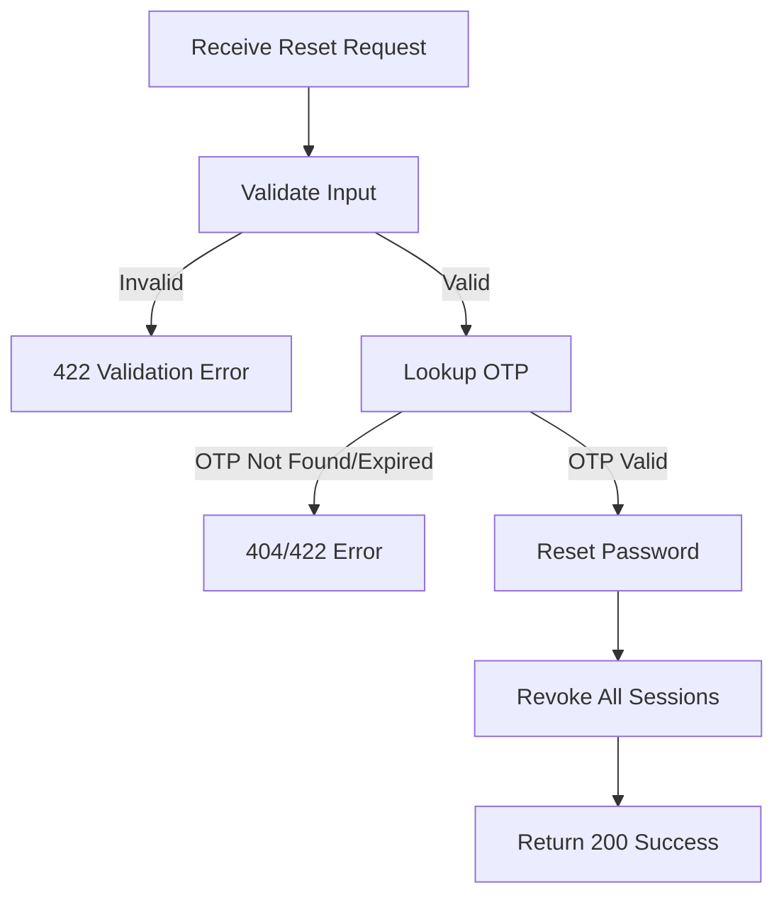

## API Name
Auth: Reset Password via OTP (POST /api/v1/auth/reset-password-otp)

Purpose: Resets user account password using an OTP sent to the user's email.

### General Information
- **Owner**: backend
- **Version**: v1
- **Status**: ready
- **Audience**: backend dev | frontend dev | QA | customer
- **Related epic/ticket**: [TBD]
---
## 1) Endpoint
- **Method**: POST
- **Base URL**: https://api.example.com
- **Path**: /api/v1/auth/reset-password-otp
- **Environment**: dev | staging | prod
- **Auth**: None
- **Rate limiting**: 10 req/hour/email (should throttle)

#### Headers
| Name          | Required | Example          | Description        |
|---------------|----------|------------------|--------------------|
| Content-Type  | Yes      | application/json | Request body format |

#### Request Body Schema
```json
{
  "email": "user@example.com (must exist)",
  "otp": "string (6 digits)",
  "password": "string >=8",
  "password_confirmation": "string (matches password)"
}
```
- `email`: required, must exist
- `otp`: required, 6 digits
- `password`: required, string, min 8, confirmed
- `password_confirmation`: must match password

#### Path Params
N/A
#### Query Params
N/A
---
## 2) Response
#### Success Example
```json
{
  "success": true,
  "data": { "message": "Password reset successfully" }
}
```
#### Error Envelope
```json
{
  "success": false,
  "message": "Short error description",
  "code": "ERROR_CODE",
  "errors": {},
  "trace_id": "uuid"
}
```
#### Common Error Codes
| HTTP | Internal code      | When it happens                | Frontend handling              |
|------|--------------------|--------------------------------|--------------------------------|
| 404  | OTP_NOT_FOUND      | OTP expired/missing            | Show error, ask resend         |
| 422  | INVALID_OTP        | Wrong OTP                      | Show input error               |
| 422  | VALIDATION_ERROR   | New password invalid           | Highlight error field          |
| 429  | OTP_LOCKED         | Too many wrong attempts        | Cooldown, prompt resend        |
| 500  | INTERNAL_ERROR     | Server error                   | Retry/support                  |

---
## 3) Flow Logic
- Validate input, lookup OTP
- OTP must be unexpired, unused and valid
- Hash and update password for user
- Revoke all current session tokens
- Return confirmation message

**Mermaid Flowchart:**

---
## 4) Database Impact
- Table(s): otps (update), users (update password), tokens (revoke)
---
## 5) Integrations & External Effects
- Email system (user will have received OTP)
---
## 6) Security
- OTP expires quickly
- All active tokens revoked on reset
---
## 7) Observability (Logging/Monitoring)
- Log reset attempts and failures
---
## 8) Performance & Scalability
- Hash + write password, single operation
---
## 9) Edge Cases & Business Rules
- Only latest valid OTP allowed
- All sessions should be closed on success
---
## 10) Testing
- Happy path, invalid OTP, expired OTP, mismatched passwords, network error
- Example:
```bash
curl -X POST "https://api.example.com/api/v1/auth/reset-password-otp" -H "Content-Type: application/json" -d '{"email":"user@example.com","otp":"987654","password":"newpassword123","password_confirmation":"newpassword123"}'
```
---
## 11) Versioning & Deprecation
- v1
---
## 12) Changelog
- [2025-10-30] Initial version – AI generated, ENGLISH
---
## 13) OpenAPI/Swagger Mapping
- Component: ApiEnvelope
---
## 14) Completion Checklist
- [x] Endpoint clear
- [x] Request schema + validation
- [x] Response schema + error codes
- [x] Flow logic described
- [x] DB impact
- [x] Security docs
- [x] Logging/metrics
- [x] Performance notes
- [x] Test/FE example
- [x] OpenAPI mapping
