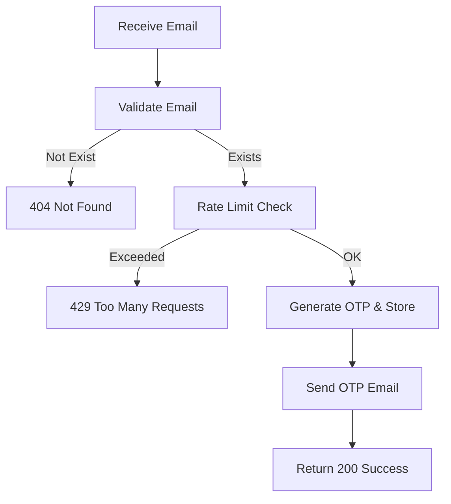

## API Name
Auth: Send Reset Password OTP (POST /api/v1/auth/send-reset-otp)

Purpose: Sends an OTP code to the user's email for password reset verification.

### General Information
- **Owner**: backend
- **Version**: v1
- **Status**: ready
- **Audience**: backend dev | frontend dev | QA | customer
- **Related epic/ticket**: [TBD]
---
## 1) Endpoint
- **Method**: POST
- **Base URL**: https://api.example.com
- **Path**: /api/v1/auth/send-reset-otp
- **Environment**: dev | staging | prod
- **Auth**: None
- **Rate limiting**: 10 req/hour/email (throttle:otp)

#### Headers
| Name          | Required | Example          | Description        |
|---------------|----------|------------------|--------------------|
| Content-Type  | Yes      | application/json | Request body format |

#### Request Body Schema
```json
{
  "email": "user@example.com (must exist)"
}
```
- `email`: required, must correspond to a user account

#### Path Params
N/A
#### Query Params
N/A
---
## 2) Response
#### Success Example
```json
{
  "success": true,
  "data": { "message": "OTP sent" }
}
```
#### Error Envelope
```json
{
  "success": false,
  "message": "Short error description",
  "code": "ERROR_CODE",
  "errors": {},
  "trace_id": "uuid"
}
```
#### Common Error Codes
| HTTP | Internal code     | When it happens           | Frontend handling           |
|------|-------------------|---------------------------|-----------------------------|
| 404  | USER_NOT_FOUND    | Email not registered      | Display error/ask signup    |
| 429  | RATE_LIMITED      | Too many requests         | Prompt cooldown             |
| 500  | INTERNAL_ERROR    | Server error              | Retry or contact support    |

---
## 3) Flow Logic
- Validate email (must exist in users)
- Generate a 6-digit OTP and store it
- Send OTP to email address

**Mermaid Flowchart:**

---
## 4) Database Impact
- Table(s): otps (insert), users (read)
---
## 5) Integrations & External Effects
- Email system (for delivering OTP)
---
## 6) Security
- OTP expires after a few minutes
- Cooldown/rate limit per account/email
---
## 7) Observability (Logging/Monitoring)
- Log send attempts and rate limiting
---
## 8) Performance & Scalability
- Email background dispatch recommended
---
## 9) Edge Cases & Business Rules
- Only the latest OTP is valid
- Expired OTPs ignored
---
## 10) Testing
- Send to existing/not registered email, rapid repeat requests, network errors
- Example:
```bash
curl -X POST "https://api.example.com/api/v1/auth/send-reset-otp" -H "Content-Type: application/json" -d '{"email":"user@example.com"}'
```
---
## 11) Versioning & Deprecation
- v1
---
## 12) Changelog
- [2025-10-30] Initial version – AI generated, ENGLISH
---
## 13) OpenAPI/Swagger Mapping
- Component: ApiEnvelope
---
## 14) Completion Checklist
- [x] Endpoint clear
- [x] Request schema + validation
- [x] Response schema + error codes
- [x] Flow logic described
- [x] DB impact
- [x] Security docs
- [x] Logging/metrics
- [x] Performance notes
- [x] Test/FE example
- [x] OpenAPI mapping
