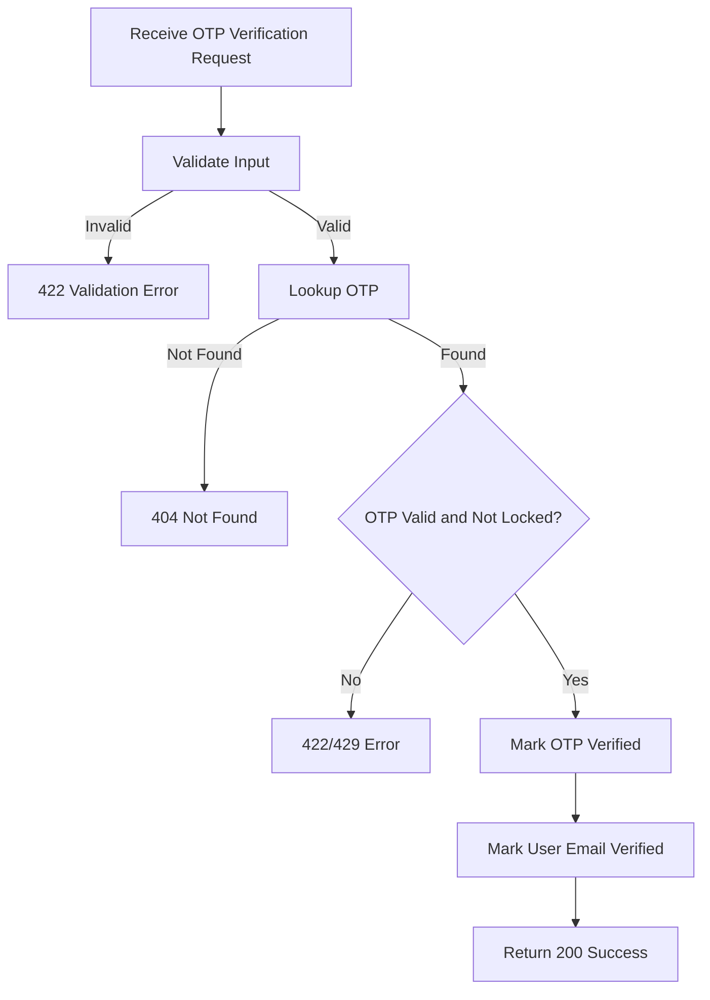

## API Name
Auth: Verify Email OTP (POST /api/v1/auth/verify-otp)

Purpose: Verifies the OTP sent to user's email for registration or other flows. Marks email as verified on success.

### General Information
- **Owner**: backend
- **Version**: v1
- **Status**: ready
- **Audience**: backend dev | frontend dev | QA | customer
- **Related epic/ticket**: [TBD]

---
## 1) Endpoint
- **Method**: POST
- **Base URL**: https://api.example.com
- **Path**: /api/v1/auth/verify-otp
- **Environment**: dev | staging | prod
- **Auth**: None
- **Rate limiting**: 60 req/minute

#### Headers
| Name          | Required | Example          | Description        |
|---------------|----------|------------------|--------------------|
| Content-Type  | Yes      | application/json | Request body format |

#### Request Body Schema
```json
{
  "email": "user@example.com (required, must exist)",
  "otp": "string (6 digits)",
  "purpose": "verify_email (optional)"
}
```

- `email`: required, must be a registered user 
- `otp`: required, string, length 6
- `purpose`: optional, default: verify_email

#### Path Params
N/A

#### Query Params
N/A

---
## 2) Response
#### Error Envelope (common)
```json
{
  "success": false,
  "message": "Short error description",
  "code": "ERROR_CODE",
  "errors": {},
  "trace_id": "uuid"
}
```
#### 200 Success Example
```json
{
  "success": true,
  "data": {
    "message": "Email verified successfully"
  }
}
```
#### Common Error Codes
| HTTP | Internal code      | When it happens                | Frontend handling           |
|------|--------------------|--------------------------------|-----------------------------|
| 404  | OTP_NOT_FOUND      | OTP missing/expired            | Show error/ask resend       |
| 422  | INVALID_OTP        | Wrong OTP                      | Show input error            |
| 429  | OTP_LOCKED         | Too many wrong attempts        | Enforce cooldown            |
| 500  | INTERNAL_ERROR     | Server error                   | Retry/support               |

---
## 3) Flow Logic
- Validate and retrieve OTP record
- Check not expired, not locked out
- Match OTP; increment attempts on fail
- Mark verified on success, update User

**Mermaid Flowchart:**

---
## 4) Database Impact
- Table(s): otps (update), users (update email_verified_at)
---
## 5) Integrations & External Effects
None
---
## 6) Security
- Expire OTP after short time window
- Lockout on brute force
---
## 7) Observability (Logging/Monitoring)
- Log invalid attempts and lockouts
---
## 8) Performance & Scalability
- Stateless verification, simple data write
---
## 9) Edge Cases & Business Rules
- OTP must not be expired or used
- Only latest valid OTP counts
---
## 10) Testing
- Correct OTP, invalid OTP, expired OTP, reused OTP, purpose mismatch
- Example:
```bash
curl -X POST "https://api.example.com/api/v1/auth/verify-otp" -H "Content-Type: application/json" -d '{"email":"user@example.com","otp":"123456"}'
```

---
## 11) Versioning & Deprecation
- v1
---
## 12) Changelog
- [2025-10-30] Initial version – AI generated, ENGLISH
---
## 13) OpenAPI/Swagger Mapping
- Component: ApiEnvelope
---
## 14) Completion Checklist
- [x] Endpoint clear
- [x] Request schema + validation
- [x] Response schema + error codes
- [x] Flow logic described
- [x] DB impact
- [x] Security docs
- [x] Logging/metrics
- [x] Performance notes
- [x] Test/FE example
- [x] OpenAPI mapping
