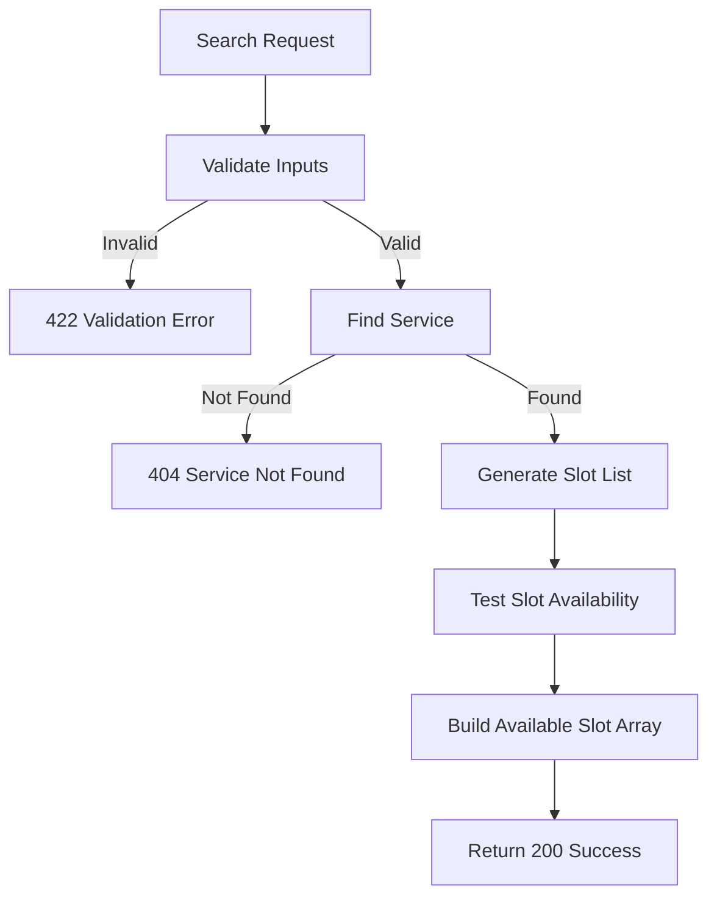

## API Name
Booking: Search Availability (GET /api/v1/availability)

Purpose: Returns available timeslots for a particular branch/service/date, optionally filtered by staff or granularity, for planning bookings.

### General Information
- **Owner**: backend
- **Version**: v1
- **Status**: ready
- **Audience**: backend dev | frontend dev | QA | customer
- **Related epic/ticket**: [TBD]
---
## 1) Endpoint
- **Method**: GET
- **Base URL**: https://api.example.com
- **Path**: /api/v1/availability
- **Auth**: None
- **Rate limiting**: 60 req/minute

#### Query Params
| Name        | Type    | Required | Example      | Description                     |
|-------------|---------|----------|--------------|---------------------------------|
| branch_id   | int     | Yes      | 2            | Branch ID                       |
| service_id  | int     | Yes      | 10           | Service ID                      |
| date        | string  | Yes      | 2025-12-01   | Date (YYYY-MM-DD)               |
| staff_id    | int     | No       | 15           | Staff (optional)                |
| granularity | int     | No       | 15           | Slot length (minutes; default 15)|

#### Headers
| Name         | Required | Example            | Description         |
|--------------|----------|--------------------|---------------------|
| Content-Type | No       | application/json   | Request format      |

#### Path Params
N/A
#### Request Body Schema
N/A
---
## 2) Response
#### Standard error envelope
```json
{
  "success": false,
  "message": "Short error description",
  "code": "ERROR_CODE",
  "errors": {},
  "trace_id": "uuid"
}
```
#### 200 Success Example
```json
{
  "success": true,
  "data": {
    "date": "2025-12-01",
    "granularity": 15,
    "available": ["09:00", "09:15", ...]
  }
}
```
#### Common Error Codes
| HTTP | Internal code      | When it happens              | Frontend handling          |
|------|--------------------|------------------------------|---------------------------|
| 422  | VALIDATION_ERROR   | Bad/missing params           | Show form errors          |
| 404  | SERVICE_NOT_FOUND  | Service not found            | Show error                |
| 500  | INTERNAL_ERROR     | Server error                 | Retry/support             |
---
## 3) Flow Logic
- Validate input (branch/service/date)
- Lookup service for duration
- Generate potential slots in chosen time window
- For each slot, query existing bookings for overlap
- Return only slots that are free

**Mermaid Flowchart:**

---
## 4) Database Impact
- Table: bookings (SELECT with filters)
---
## 5) Integrations & External Effects
None
---
## 6) Security
- Public endpoint
---
## 7) Observability (Logging/Monitoring)
- Log errors/failures
---
## 8) Performance & Scalability
- Slot gen and scan, can cache for hotspot/predictable flows
---
## 9) Edge Cases & Business Rules
- Must ignore past/overlapping/invalid slots
---
## 10) Testing
- Slots filled, various durations, invalid input
- Example:
```bash
curl "https://api.example.com/api/v1/availability?branch_id=2&service_id=10&date=2025-12-01"
```
---
## 11) Versioning & Deprecation
- v1
---
## 12) Changelog
- [2025-10-30] Initial version – ENGLISH
---
## 13) OpenAPI/Swagger Mapping
- Component: SlotList, ApiEnvelope
---
## 14) Completion Checklist
- [x] Endpoint clear
- [x] Request schema & validation
- [x] Response schema & error codes
- [x] Flow logic documented
- [x] DB impact
- [x] Security
- [x] Logging/metrics
- [x] Test/FE example
- [x] OpenAPI mapping
