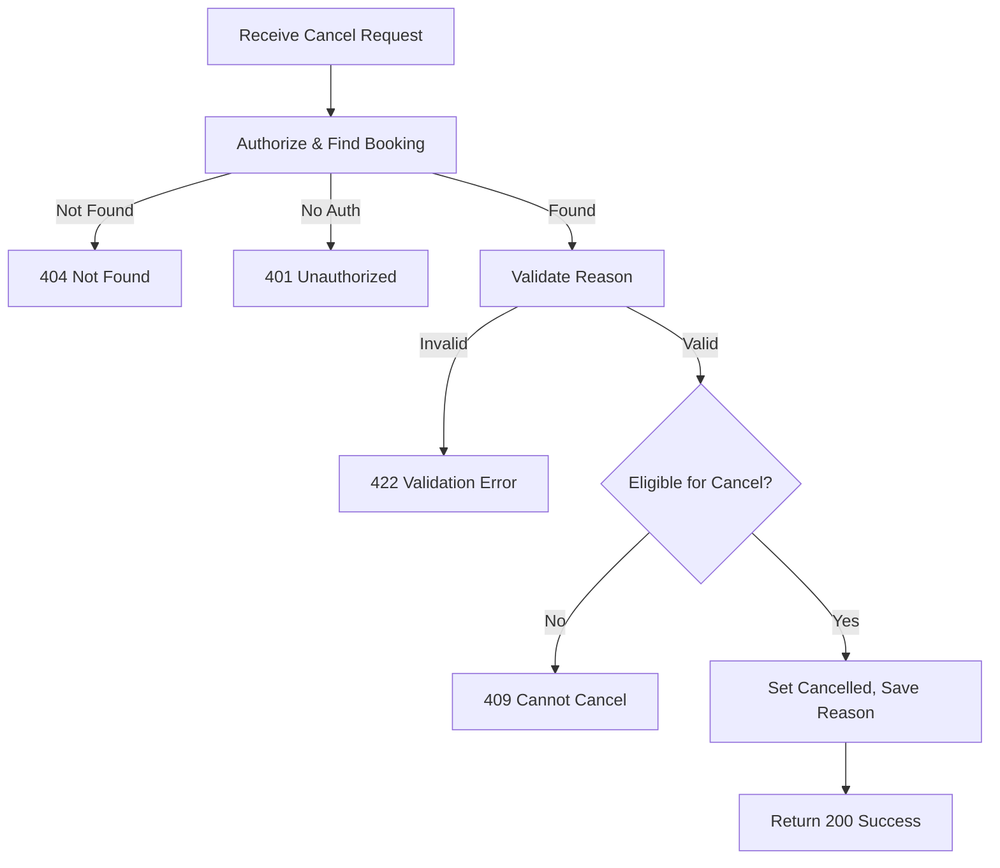

## API Name
Booking: Cancel Booking (POST /api/v1/bookings/{id}/cancel)

Purpose: Allows authenticated users to cancel an existing booking by providing a cancellation reason.

### General Information
- **Owner**: backend
- **Version**: v1
- **Status**: ready
- **Audience**: backend dev | frontend dev | QA | customer
- **Related epic/ticket**: [TBD]

---
## 1) Endpoint
- **Method**: POST
- **Base URL**: https://api.example.com
- **Path**: /api/v1/bookings/{id}/cancel
- **Auth**: Bearer token required
- **Rate limiting**: 60 req/minute

#### Headers
| Name          | Required | Example                | Description            |
|---------------|----------|------------------------|------------------------|
| Authorization | Yes      | Bearer <token>         | User authentication    |
| Content-Type  | Yes      | application/json       | Request format         |

#### Path Params
| Name | Type | Required | Example | Description     |
|------|------|----------|---------|-----------------|
| id   | int  | Yes      | 552     | Booking ID      |

#### Request Body Schema
```json
{
  "cancellation_reason": "string, required, max 500"
}
```
- `cancellation_reason`: required, string

#### Query Params
N/A
---
## 2) Response
#### Standard Error Envelope
```json
{
  "success": false,
  "message": "Short error description",
  "code": "ERROR_CODE",
  "errors": {},
  "trace_id": "uuid"
}
```
#### 200 Success Example
```json
{
  "success": true,
  "data": {
    ...updated booking object...
    "status": "cancelled",
    "cancellation_reason": "Reason provided by user"
  }
}
```
#### Common Error Codes
| HTTP | Internal code      | When it happens          | Frontend handling   |
|------|--------------------|--------------------------|---------------------|
| 401  | UNAUTHORIZED       | Not logged in            | Prompt login        |
| 404  | NOT_FOUND          | Booking doesn't exist    | Show not found      |
| 422  | VALIDATION_ERROR   | Invalid/missing reason   | Show error field    |
| 409  | CANNOT_CANCEL      | Not allowed by policy    | Explain restriction |

---
## 3) Flow Logic
- Authorize user, lookup booking ID
- Validate input
- Check cancel policy (future status, cutoff time)
- Set status to cancelled, save cancellation reason
- Return updated booking

**Mermaid Flowchart:**

---
## 4) Database Impact
- Table: bookings (UPDATE status, reason, cancelled_at). Status history log.
---
## 5) Integrations & External Effects
- Possible email/SMS cancel notice.
---
## 6) Security
- Only booking owner/admin can cancel.
---
## 7) Observability (Logging/Monitoring)
- Log cancel actions for audit.
---
## 8) Performance & Scalability
- Standard DB update.
---
## 9) Edge Cases & Business Rules
- Can't cancel if already completed, cutoff passed, or not in allowed states.
---
## 10) Testing
- Valid/invalid reason, too late to cancel, already cancelled, not found case.
- Example cURL:
```bash
curl -X POST "https://api.example.com/api/v1/bookings/552/cancel" \
-H "Authorization: Bearer <token>" -H "Content-Type: application/json" \
-d '{"cancellation_reason":"Schedule conflict"}'
```
---
## 11) Versioning & Deprecation
- v1
---
## 12) Changelog
- [2025-10-30] Initial version – ENGLISH
---
## 13) OpenAPI/Swagger Mapping
- Component: BookingResource, ApiEnvelope
---
## 14) Completion Checklist
- [x] Endpoint clear
- [x] Request schema & validation
- [x] Response schema & error codes
- [x] Flow logic documented
- [x] DB impact
- [x] Security
- [x] Logging/metrics
- [x] Test/FE example
- [x] OpenAPI mapping
