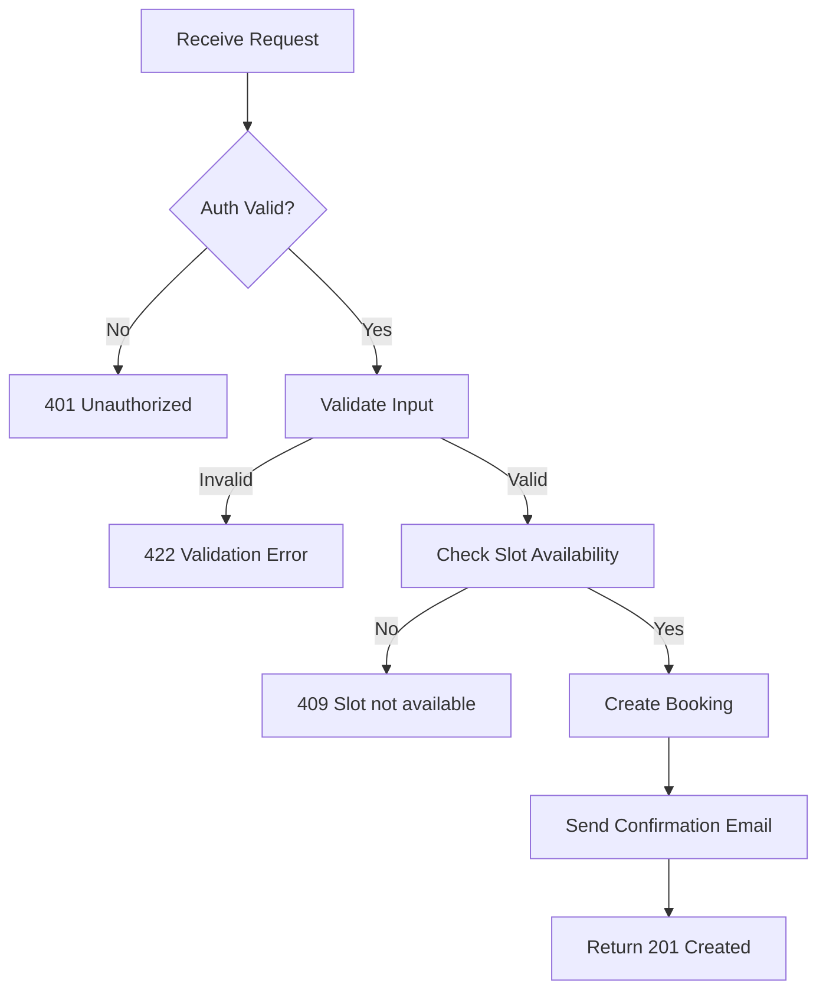

## API Name
Booking: Create Booking (POST /api/v1/bookings)

Purpose: Authenticated users create a new booking for a service at a branch, specifying staff, date, and time.

### General Information
- **Owner**: backend
- **Version**: v1
- **Status**: ready
- **Audience**: backend dev | frontend dev | QA | customer
- **Related epic/ticket**: [TBD]

---
## 1) Endpoint
- **Method**: POST
- **Base URL**: https://api.example.com
- **Path**: /api/v1/bookings
- **Auth**: Bearer token / Sanctum required
- **Rate limiting**: 60 req/minute

#### Headers
| Name           | Required | Example               | Description             |
|----------------|----------|----------------------|-------------------------|
| Authorization  | Yes      | Bearer <token>       | User authentication     |
| Content-Type   | Yes      | application/json     | Request format          |

#### Request Body Schema
```json
{
  "branch_id": 1,
  "service_id": 10,
  "staff_id": 100,
  "booking_date": "2025-11-01",
  "booking_time": "14:00",
  "notes": "string (optional)",
  "promotion_code": "string (optional)"
}
```
- All fields required except notes/promotion_code (branch/service/staff IDs must exist, date after today, time format HH:mm)

#### Path Params
N/A
#### Query Params
N/A
---
## 2) Response
#### Error Envelope (standard)
```json
{
  "success": false,
  "message": "Short error description",
  "code": "ERROR_CODE",
  "errors": {},
  "trace_id": "uuid"
}
```
#### 201 Success Example
```json
{
  "success": true,
  "data": {
    "id": 1002,
    "booking_code": "BK20250916ABCDZ",
    "branch_id": 1,
    "service_id": 10,
    "staff_id": 100,
    "user_id": 234,
    "booking_date": "2025-11-01",
    "booking_time": "14:00",
    "status": "pending",
    "total_amount": 500000,
    "payment_status": "pending",
    ...
  }
}
```
#### Common Error Codes
| HTTP | Internal code     | When it happens                        | Frontend handling       |
|------|-------------------|----------------------------------------|------------------------|
| 401  | UNAUTHORIZED      | Not logged in                          | Prompt login           |
| 422  | VALIDATION_ERROR  | Input failed checks                    | Show form errors       |
| 409  | TIME_UNAVAILABLE  | Time slot not available                | Prompt select other    |
| 500  | INTERNAL_ERROR    | Server error                           | Retry/support          |

---
## 3) Flow Logic
- Validate all fields, check slot availability
- Fetch price, duration from service
- Create booking, set pending status
- Send email confirmation to user
- Return booking details

**Mermaid Flowchart:**

---
## 4) Database Impact
- Table: bookings (INSERT), status_history
---
## 5) Integrations & External Effects
- Confirmation email via job/queue
---
## 6) Security
- Auth required, input validated (branch/service/staff must exist)
---
## 7) Observability (Logging/Monitoring)
- Log errors, failures, suspicious high frequency
---
## 8) Performance & Scalability
- Per-request validation/scenario
---
## 9) Edge Cases & Business Rules
- Cannot book for past/finalized slot/time
- User can only book future slots
---
## 10) Testing
- Happy path, staff/service not available, fully booked slot, invalid request
- Example:
```bash
curl -X POST "https://api.example.com/api/v1/bookings" -H "Authorization: Bearer <token>" -H "Content-Type: application/json" -d '{"branch_id":1,"service_id":10,"staff_id":100,"booking_date":"2025-11-01","booking_time":"14:00"}'
```
---
## 11) Versioning & Deprecation
- v1
---
## 12) Changelog
- [2025-10-30] Initial version – ENGLISH
---
## 13) OpenAPI/Swagger Mapping
- Component: BookingResource, ApiEnvelope
---
## 14) Completion Checklist
- [x] Endpoint clear
- [x] Request schema & validation
- [x] Response schema & error codes
- [x] Flow logic document
- [x] DB impact
- [x] Security
- [x] Logging/metrics
- [x] Performance note
- [x] Test/FE example
- [x] OpenAPI mapping
