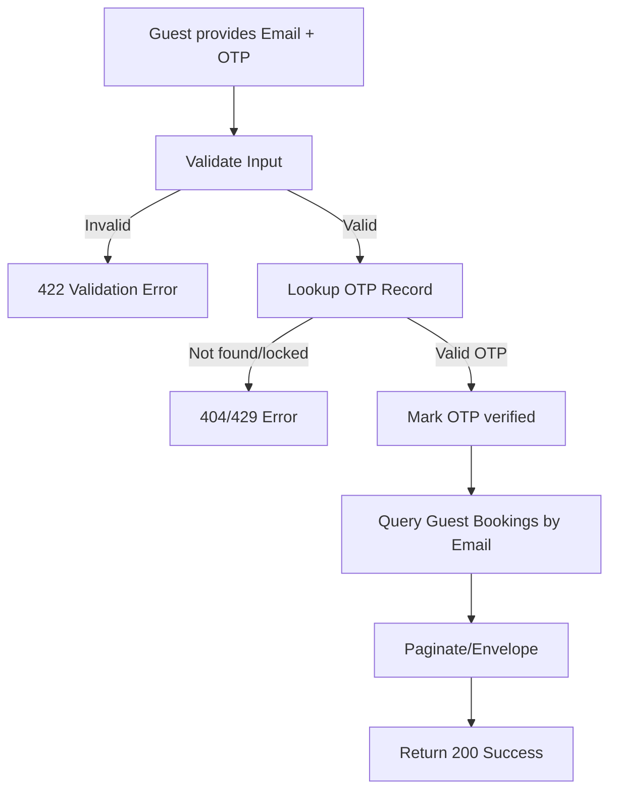

## API Name
Booking: List Guest Bookings (GET /api/v1/guest-bookings)

Purpose: Allows guests to access and view their bookings using email and validated OTP (no login required).

### General Information
- **Owner**: backend
- **Version**: v1
- **Status**: ready
- **Audience**: backend dev | frontend dev | QA | customer
- **Related epic/ticket**: [TBD]
---
## 1) Endpoint
- **Method**: GET
- **Base URL**: https://api.example.com
- **Path**: /api/v1/guest-bookings
- **Auth**: None
- **Rate limiting**: 20 req/hour/email

#### Query Params
| Name           | Type   | Required | Example                | Description                   |
|----------------|--------|----------|------------------------|-------------------------------|
| guest_email    | email  | Yes      | test@guest.com         | Guest's email for lookup      |
| guest_email_otp| string | Yes      | 123456                 | OTP received by email (6-digit)|
| page           | int    | No       | 1                      | Pagination page               |
| per_page       | int    | No       | 10                     | Pagination limit              |

#### Headers
| Name         | Required | Example            | Description         |
|--------------|----------|--------------------|---------------------|
| Content-Type | No       | application/json   | Request format      |

#### Path Params
N/A
#### Request Body Schema
N/A
---
## 2) Response
#### Standard error envelope
```json
{
  "success": false,
  "message": "Short error description",
  "code": "ERROR_CODE",
  "errors": {},
  "trace_id": "uuid"
}
```
#### 200 Success Example
```json
{
  "success": true,
  "data": [
    { ...booking object... }, ...
  ],
  "meta": { "pagination": { "page": 1, "per_page": 10, "total": 6 } }
}
```
#### Common Error Codes
| HTTP | Internal code      | When it happens            | Frontend handling   |
|------|--------------------|----------------------------|---------------------|
| 422  | VALIDATION_ERROR   | Invalid/missing params     | Show error message  |
| 404  | OTP/USER_NOT_FOUND | Wrong/expired OTP/email    | Prompt re-request   |
| 429  | TOO_MANY_ATTEMPTS  | Too many OTP failures      | Delay input         |
| 500  | INTERNAL_ERROR     | Server error               | Retry/support       |
---
## 3) Flow Logic
- Receive email and OTP, validate input
- OTP must be latest, valid, non-expired, not locked out
- On success, list all bookings linked to guest email
- Paginated

**Mermaid Flowchart:**

---
## 4) Database Impact
- Table: bookings (SELECT with guest_email, pagination)
- Table: otps (lookup, verify)
---
## 5) Integrations & External Effects
- Guest receives OTP by email (see guest_send_otp)
---
## 6) Security
- Only latest OTP for guest_email is valid
---
## 7) Observability (Logging/Monitoring)
- Log OTP/guest activity
---
## 8) Performance & Scalability
- Index on guest_email, paginated scan
---
## 9) Edge Cases & Business Rules
- Repeated OTP failures lock out further attempts
---
## 10) Testing
- Valid flow, bad OTP, repeated error, expired OTP
- Example:
```bash
curl "https://api.example.com/api/v1/guest-bookings?guest_email=test@guest.com&guest_email_otp=123456" \
  -H "Content-Type: application/json"
```
---
## 11) Versioning & Deprecation
- v1
---
## 12) Changelog
- [2025-10-30] Initial version – ENGLISH
---
## 13) OpenAPI/Swagger Mapping
- Component: BookingResource, ApiEnvelope
---
## 14) Completion Checklist
- [x] Endpoint clear
- [x] Request schema & validation
- [x] Response schema & error codes
- [x] Flow logic documented
- [x] DB impact
- [x] Security
- [x] Logging/metrics
- [x] Test/FE example
- [x] OpenAPI mapping
