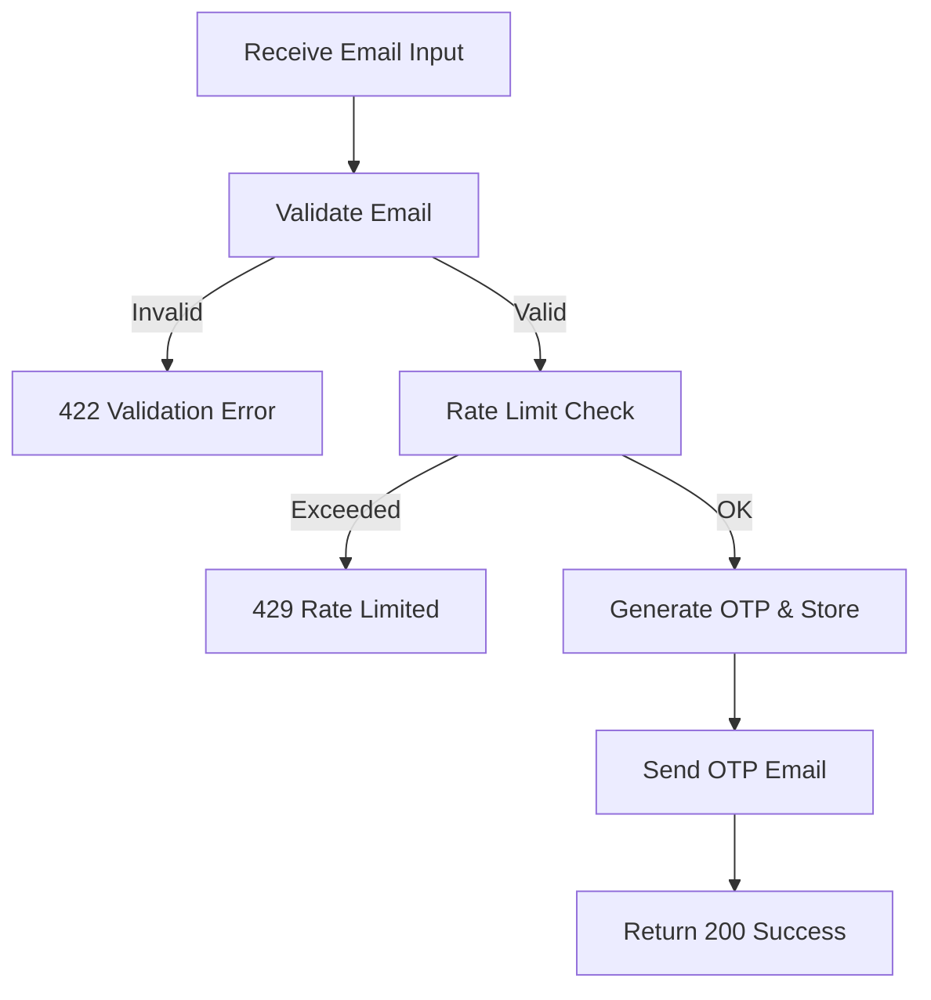

## API Name
Booking: Send OTP for Guest Booking (POST /api/v1/guest-booking/send-otp)

Purpose: Lets a guest (not logged in) request a verification OTP to their email for accessing their bookings.

### General Information
- **Owner**: backend
- **Version**: v1
- **Status**: ready
- **Audience**: backend dev | frontend dev | QA | customer
- **Related epic/ticket**: [TBD]
---
## 1) Endpoint
- **Method**: POST
- **Base URL**: https://api.example.com
- **Path**: /api/v1/guest-booking/send-otp
- **Auth**: None
- **Rate limiting**: 10 req/hour/email

#### Headers
| Name         | Required | Example            | Description         |
|--------------|----------|--------------------|---------------------|
| Content-Type | Yes      | application/json   | Request format      |

#### Request Body Schema
```json
{
  "guest_email": "guest@demo.com"  // required, must be valid email
}
```
- guest_email: required, valid email

#### Path Params
N/A
#### Query Params
N/A
---
## 2) Response
#### Standard error envelope
```json
{
  "success": false,
  "message": "Short error description",
  "code": "ERROR_CODE",
  "errors": {},
  "trace_id": "uuid"
}
```
#### 200 Success Example
```json
{
  "success": true,
  "data": {"message": "OTP sent"}
}
```
#### Common Error Codes
| HTTP | Internal code      | When it happens          | Frontend handling   |
|------|--------------------|--------------------------|---------------------|
| 422  | VALIDATION_ERROR   | Invalid/missing email    | Show error          |
| 429  | RATE_LIMITED       | Too many sent/abuse      | Delay further input |
| 500  | INTERNAL_ERROR     | Server error             | Retry/support       |
---
## 3) Flow Logic
- Validate input email
- Rate limit per email
- Generate OTP and save record
- Send OTP email (with expiry)
- Respond with confirmation

**Mermaid Flowchart:**

---
## 4) Database Impact
- Table: otps (CREATE)
---
## 5) Integrations & External Effects
- Email service (rate-limited)
---
## 6) Security
- Tracks OTP frequency per email
---
## 7) Observability (Logging/Monitoring)
- Email send and block logs
---
## 8) Performance & Scalability
- Send done async if possible
---
## 9) Edge Cases & Business Rules
- Most recent OTP per guest applies, old OTPs invalid
---
## 10) Testing
- Typical, repeated, rapid, invalid, abusive uses
- Example:
```bash
curl -X POST "https://api.example.com/api/v1/guest-booking/send-otp" -H "Content-Type: application/json" -d '{"guest_email":"guest@demo.com"}'
```
---
## 11) Versioning & Deprecation
- v1
---
## 12) Changelog
- [2025-10-30] Initial version – ENGLISH
---
## 13) OpenAPI/Swagger Mapping
- Component: ApiEnvelope
---
## 14) Completion Checklist
- [x] Endpoint clear
- [x] Request schema & validation
- [x] Response schema & error codes
- [x] Flow logic documented
- [x] DB impact
- [x] Security
- [x] Logging/metrics
- [x] Test/FE example
- [x] OpenAPI mapping
