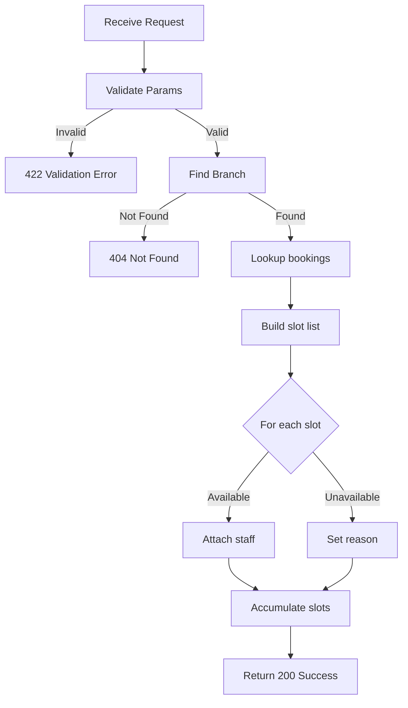

## API Name
Branch: Get Available Time Slots (`GET /api/v1/branches/{id}/available-slots`)

Purpose: Retrieve available booking time slots for a specific branch, service, date, and optionally filtered by staff.

### General Information
- **Owner**: backend
- **Version**: v1
- **Status**: ready
- **Audience**: backend dev | frontend dev | QA | customer
- **Related epic/ticket**: [TBD]

---
## 1) Endpoint
- **Method**: GET
- **Base URL**: https://api.example.com
- **Path**: /api/v1/branches/{id}/available-slots
- **Environment**: dev | staging | prod
- **Auth**: None
- **Rate limiting**: 60 req/minute
- **Caching**: Disabled (always realtime)

#### Headers
| Name         | Required | Example             | Description        |
|--------------|----------|---------------------|--------------------|
| Content-Type | Yes      | application/json    | Request format     |

#### Path Params
| Name | Type | Required | Example | Description                   |
|------|------|----------|---------|-------------------------------|
| id   | int  | Yes      | 1       | The branch ID                 |

#### Query Params
| Name       | Type   | Required | Example    | Description                                 |
|------------|--------|----------|------------|---------------------------------------------|
| date       | string | Yes      | 2025-10-30 | Booking date (YYYY-MM-DD)                   |
| service_id | int    | Yes      | 3          | Service ID                                 |
| staff_id   | int    | No       | 12         | Staff ID (optional, for filtering staff)    |

#### Request Body Schema
N/A

---
## 2) Response
#### Error Envelope (standard)
```json
{
  "success": false,
  "message": "Branch not found or error description",
  "code": "NOT_FOUND",
  "errors": {},
  "trace_id": "uuid"
}
```
#### 200 Success Example
```json
{
  "success": true,
  "data": [
    { "time": "09:00", "available": true, "staff": [ {"id":1, "name":"John A"} ] },
    { "time": "09:30", "available": false, "reason": "Fully booked" }
  ]
}
```
*Each slot object:*
- `time`: string (HH:mm), slot start time
- `available`: boolean
- `staff`: array (if available), available staff for the slot [{ id, name, ... }]
- `reason`: string (optional, only present if unavailable)

#### Common Error Codes
| HTTP | Internal code      | When it happens              | Frontend handling       |
|------|--------------------|------------------------------|------------------------|
| 404  | NOT_FOUND          | Branch does not exist        | Show empty state       |
| 422  | VALIDATION_ERROR   | Invalid/missing parameters   | Highlight form errors  |
| 500  | INTERNAL_ERROR     | Server error                 | Retry/Contact support  |

---
## 3) Flow Logic
- Validate: branch ID, date, service_id, (optionally staff_id)
- Fetch bookings for the day, generate slot list (09:00-18:00 in 30 min intervals)
- Determine which slots are available or fully booked; attach available staff (if any)
- Return slot listing

**Mermaid Flowchart:**

---
## 4) Database Impact
- Primary: bookings, branches
- Related: staff, services (if filtering per slot)
- Indexes: time, staff_id, branch_id, service_id
- Transactions: none
---
## 5) Integrations & External Effects
None
---
## 6) Security
- Public, no authentication required
---
## 7) Observability (Logging/Monitoring)
- Application logs errors, exceptions
---
## 8) Performance & Scalability
- Realtime slot calculation, possible optimizations: micro-caching for popular slots/days
---
## 9) Edge Cases & Business Rules
- Input date in the past/weekends/outside business hours returns unavailable slots
---
## 10) Testing
- Valid request, missing/invalid params, branch does not exist, fully booked day
- Example cURL:
```bash
curl "https://api.example.com/api/v1/branches/1/available-slots?date=2025-10-30&service_id=3"
```
---
## 11) Versioning & Deprecation
- v1
---
## 12) Changelog
- [2025-10-30] Initial version – ENGLISH
---
## 13) OpenAPI/Swagger Mapping
- Component: SlotList, ApiEnvelope
---
## 14) Completion Checklist
- [x] Endpoint, method, headers clear
- [x] Request schema & validation
- [x] Response schema & error codes
- [x] Flow logic complete
- [x] DB impact
- [x] Security
- [x] Logging/metrics
- [x] Performance note
- [x] Test/FE example
- [x] OpenAPI mapping
