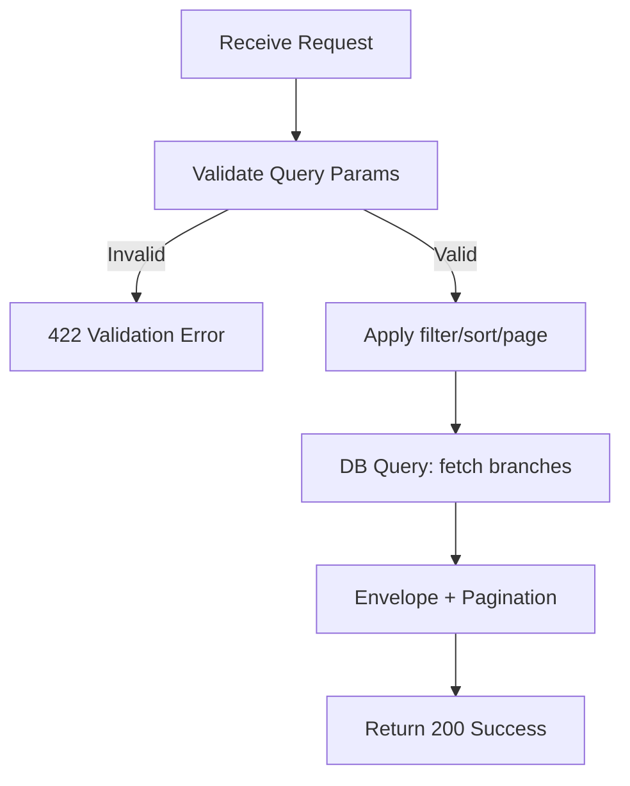

## API Name
Branch: List Branches (GET /api/v1/branches)

Purpose: Fetches a paginated list of all available branches. Supports paging, state filtering, and sorting options.

### General Information
- **Owner**: backend
- **Version**: v1
- **Status**: ready
- **Audience**: backend dev | frontend dev | QA | customer
- **Related epic/ticket**: [TBD]
---
## 1) Endpoint
- **Method**: GET
- **Base URL**: https://api.example.com
- **Path**: /api/v1/branches
- **Environment**: dev | staging | prod
- **Auth**: None
- **Rate limiting**: 60 req/minute
- **Caching**: [ETag, Cache-Control if implemented]

#### Headers
| Name         | Required | Example          | Description          |
|--------------|----------|------------------|----------------------|
| Content-Type | Yes      | application/json | Request format       |

#### Path Params
N/A

#### Query Params
| Name      | Type   | Required | Default | Example     | Description                                      |
|-----------|--------|----------|---------|-------------|--------------------------------------------------|
| page      | int    | No       | 1       | 2           | Pagination page                                  |
| per_page  | int    | No       | 20      | 50          | Items per page                                   |
| sort      | string | No       | -       | name:asc    | Sort by id, name, created_at (asc or desc)       |
| is_active | bool   | No       | -       | true        | Filter by active/inactive branches               |

#### Request Body Schema
N/A
---
## 2) Response
#### Error Envelope (standard)
```json
{
  "success": false,
  "message": "Short error description",
  "code": "ERROR_CODE",
  "errors": {},
  "trace_id": "uuid"
}
```
#### 200 Success Example
```json
{
  "success": true,
  "data": [
    {
      "id": 1,
      "name": {"en": "Spa & Beauty Center ..."},
      "slug": "spa-beauty-center-quan-1",
      "address": {"en": "123 Main ..."},
      "phone": "028 3829 1234",
      "email": "branch1@example.com",
      "latitude": 10.7769,
      "longitude": 106.7009,
      "opening_hours": {"monday": ["09:00", "20:00"]},
      "images": ["/storage/branches/b1.jpg"],
      "description": {"en": "Main downtown branch ..."},
      "amenities": ["WiFi", "Parking"],
      "is_active": true,
      "display_order": 1,
      "created_at": "2025-10-30T12:34:56Z",
      "updated_at": "2025-10-30T12:34:56Z"
      // "services": [...] (if included)
    }
  ],
  "meta": {
    "pagination": { "page": 1, "per_page": 20, "total": 6 }
  }
}
```
#### Common Error Codes
| HTTP | Internal code    | When it happens              | Frontend handling    |
|------|------------------|------------------------------|---------------------|
| 400  | VALIDATION_ERROR | Invalid parameters           | Show field errors   |
| 404  | NOT_FOUND        | No branches found            | Show empty state    |
| 500  | INTERNAL_ERROR   | Server error                 | Retry/support       |
---
## 3) Flow Logic
- Validate query params
- Apply filters, sorting, pagination to the branch DB query
- Return results with pagination meta

**Mermaid Flowchart:**

---
## 4) Database Impact
- Primary: branches (SELECT)
- Related: (eager load `services` if included)
- Indexes used: slug, [latitude, longitude], sort fields
---
## 5) Integrations & External Effects
None
---
## 6) Security
- Public, no authentication required
---
## 7) Observability (Logging/Monitoring)
- Default app logging applies
---
## 8) Performance & Scalability
- Supports efficient paging and sorting
---
## 9) Edge Cases & Business Rules
- Empty result if no branches match criteria
---
## 10) Testing
- Happy path, empty data, filter by is_active, various sorting
- Example cURL:
```bash
curl "https://api.example.com/api/v1/branches?page=1&per_page=10&is_active=true"
```
---
## 11) Versioning & Deprecation
- v1
---
## 12) Changelog
- [2025-10-30] Initial English version
---
## 13) OpenAPI/Swagger Mapping
- Component: BranchResource, ApiEnvelope
---
## 14) Completion Checklist
- [x] Endpoint clear
- [x] Request schema & validation
- [x] Response schema & error codes
- [x] Flow logic complete
- [x] DB impact
- [x] Security
- [x] Logging/metrics
- [x] Performance note
- [x] Test/FE example
- [x] OpenAPI mapping
