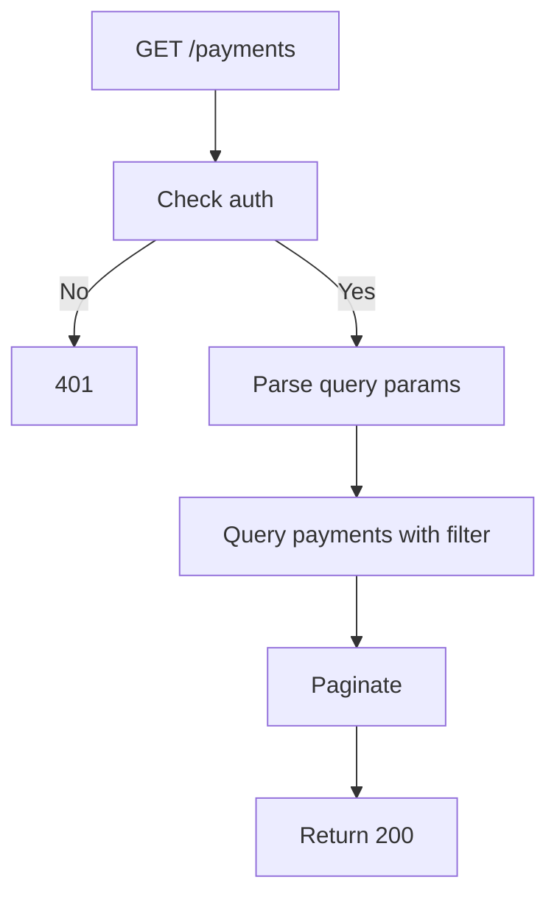

## API Name
Payment: List My Payments (GET /api/v1/payments)

Purpose: Authenticated user retrieves their own payment transactions for bookings (VNPay, cards, etc.). Supports filter and page.

### General Information
- **Owner**: backend
- **Version**: v1
- **Status**: ready
- **Audience**: user | frontend dev | backend dev | QA
- **Related epic/ticket**: [TBD]
---
## 1) Endpoint
- **Method**: GET
- **Base URL**: https://api.example.com
- **Path**: /api/v1/payments
- **Auth**: Required (Bearer token)
- **Rate limiting**: 30 req/minute

#### Headers
| Name           | Required | Example              | Description          |
|----------------|----------|----------------------|----------------------|
| Authorization  | Yes      | Bearer <token>       | User authentication  |
| Content-Type   | No       | application/json     | Request format       |

#### Query Params
| Name          | Type   | Required | Example     | Description                       |
|---------------|--------|----------|-------------|-----------------------------------|
| status        | string | No       | completed   | Filter by status (pending,completed,failed,refunded) |
| payment_method| string | No       | vnpay       | Filter (vnpay, card, stripe, etc.)|
| page          | int    | No       | 1           | Pagination page                   |
| per_page      | int    | No       | 15          | Items per page                    |

#### Path Params
N/A
#### Request Body Schema
N/A
---
## 2) Response
#### Error envelope
```json
{
  "success": false,
  "message": "Unauthorized or error desc",
  "code": "ERROR_CODE",
  "errors": {},
  "trace_id": "uuid"
}
```
#### 200 Example
```json
{
  "success": true,
  "data": [
    { "id":153, "status":"completed", "payment_method":"vnpay", ... }, ...
  ],
  "meta": {"pagination": {"page":1,"per_page":15,"total":7}}
}
```
#### Common Error Codes
| HTTP | Internal code    | When it happens         | Frontend handling   |
|------|------------------|-------------------------|---------------------|
| 401  | UNAUTHORIZED     | Not logged in           | Prompt login        |
| 400  | VALIDATION_ERROR | Bad query               | Show error          |
| 500  | INTERNAL_ERROR   | Server error            | Retry               |
---
## 3) Flow Logic
- Auth user, parse query params
- Filter, paginate payment records
- Return envelope

**Mermaid Flowchart:**

---
## 4) Database Impact
- Table: payments (SELECT for user, filter, paginate)
---
## 5) Integrations & External Effects
None
---
## 6) Security
- User must be logged in; can only see own payments
---
## 7) Observability (Logging/Monitoring)
- Log access, volume, errors
---
## 8) Performance & Scalability
- Covers user’s history, paginated
---
## 9) Edge Cases & Business Rules
- Empty for users without payments
---
## 10) Testing
- Various status/method filters, paged, unauthorized
- Example:
```bash
curl -H "Authorization: Bearer <token>" "https://api.example.com/api/v1/payments?status=completed"
```
---
## 11) Versioning & Deprecation
- v1
---
## 12) Changelog
- [2025-10-30] Initial version – ENGLISH
---
## 13) OpenAPI/Swagger Mapping
- Component: PaymentResource, ApiEnvelope
---
## 14) Completion Checklist
- [x] Endpoint clear
- [x] Query schema
- [x] Response schema
- [x] Errors
- [x] Mermaid chart
- [x] DB impact
- [x] Security/edge tests
- [x] OpenAPI mapping
