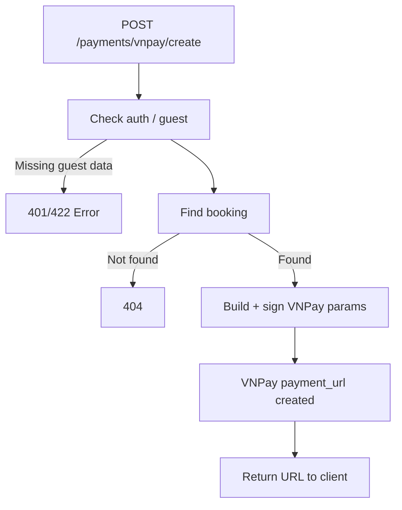

## API Name
Payment: Create VNPay Payment URL (POST /api/v1/payments/vnpay/create)

Purpose: Request a VNPay payment link/URL so the user (or guest) can pay for a booking. Used for redirect/app payment.

### General Information
- **Owner**: backend
- **Version**: v1
- **Status**: ready
- **Audience**: frontend dev | backend dev | QA | customer
- **Related epic/ticket**: [TBD]
---
## 1) Endpoint
- **Method**: POST
- **Base URL**: https://api.example.com
- **Path**: /api/v1/payments/vnpay/create
- **Auth**: None (both logged-in & guest supported)
- **Rate limiting**: 10 req/user/hour

#### Headers
| Name         | Required | Example            | Description        |
|--------------|----------|--------------------|--------------------|
| Content-Type | Yes      | application/json   | Request format     |
| Authorization| No       | Bearer <token>     | If logged in       |

#### Request Body Schema
```json
{
  "booking_id": 4011,
  "bank_code": "VNBANK",
  "language": "en",
  "guest_email": "guest@mail.com",  // For guest flow only
  "guest_phone": "+84978990011"     // For guest flow only
}
```
- booking_id: required (target booking)
- bank_code: optional (specify VNPay bank, default:blank=auto)
- language: optional (en or vi)
- guest_email/phone: **required if user is not authenticated**

#### Path Params
N/A
#### Query Params
N/A
---
## 2) Response
#### Error envelope
```json
{
  "success": false,
  "message": "Short error description",
  "code": "ERROR_CODE",
  "errors": {},
  "trace_id": "uuid"
}
```
#### 200 Example
```json
{
  "success": true,
  "data": {
    "payment_url": "https://sandbox.vnpay.vn/qrpay.html?...",
    ...
  }
}
```
#### Common Error Codes
| HTTP | Internal code     | When it happens                       | Frontend handling   |
|------|-------------------|---------------------------------------|---------------------|
| 401  | UNAUTHORIZED      | Guest missing info                    | Prompt complete     |
| 404  | BOOKING_NOT_FOUND | Booking missing/invalid               | Show info           |
| 422  | VALIDATION_ERROR  | Invalid field                         | Show error          |
| 500  | INTERNAL_ERROR    | VNPay error/server                    | Retry/support       |
---
## 3) Flow Logic
- Auth/validate request fields (or guest info)
- Lookup booking
- Generate payment params, sign, call VNPay
- Receive payment_url; return to client

**Mermaid Flowchart:**

---
## 4) Database Impact
- Table: bookings (validate, no change)
- Logs for payment create
---
## 5) Integrations & External Effects
- VNPay gateway (outbound request)
---
## 6) Security
- Signed, audited
---
## 7) Observability (Logging/Monitoring)
- Log VNPay/API request
---
## 8) Performance & Scalability
- External call, fast
---
## 9) Edge Cases & Business Rules
- Guest required fields; booking locked/paid/invalid
---
## 10) Testing
- User/guest, bank code, missing fields, happy/fail
- Example:
```bash
curl -X POST "https://api.example.com/api/v1/payments/vnpay/create" -H "Content-Type: application/json" -d '{"booking_id":4011,"guest_email":"guest@mail.com","guest_phone":"+84978990011"}'
```
---
## 11) Versioning & Deprecation
- v1
---
## 12) Changelog
- [2025-10-30] Initial version – ENGLISH
---
## 13) OpenAPI/Swagger Mapping
- Component: PaymentResource, ApiEnvelope
---
## 14) Completion Checklist
- [x] Endpoint clear
- [x] Request schema
- [x] Response schema
- [x] Errors
- [x] Mermaid chart
- [x] External call
- [x] Security & test cases
- [x] OpenAPI mapping
