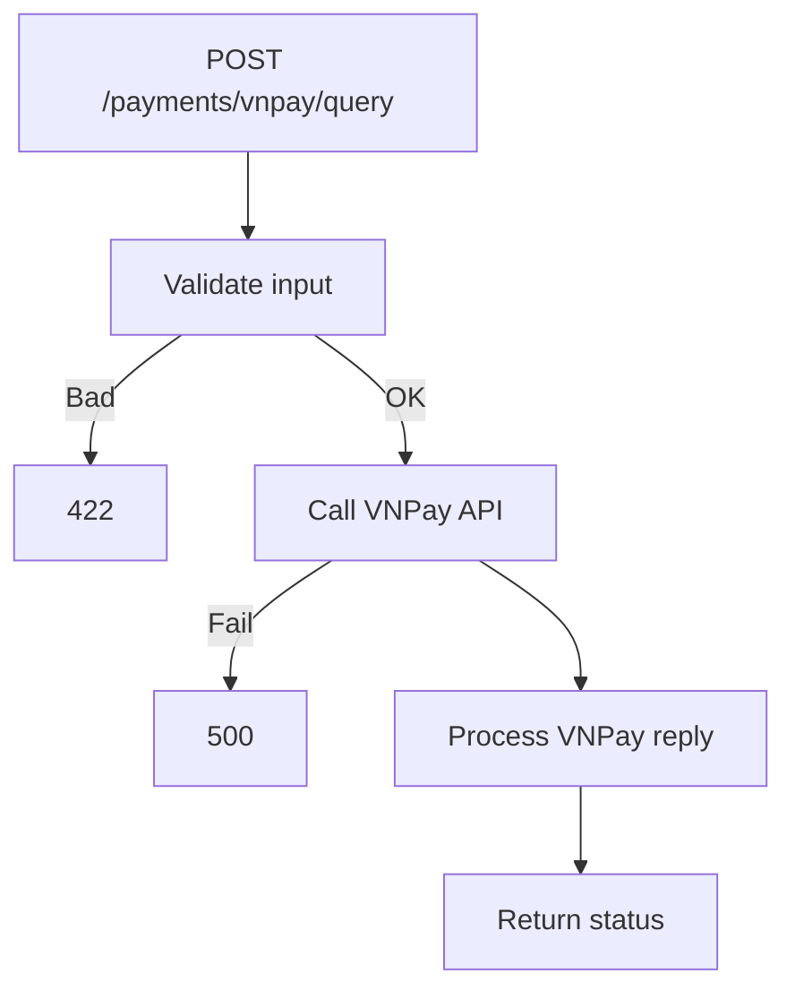

## API Name
Payment: VNPay Query Transaction (POST /api/v1/payments/vnpay/query)

Purpose: Endpoint lets user/guest query the real-time status of a VNPay transaction by transaction_id and (optionally) contact info.

### General Information
- **Owner**: backend
- **Version**: v1
- **Status**: ready
- **Audience**: frontend dev | backend dev | support | guest
---
## 1) Endpoint
- **Method**: POST
- **Base URL**: https://api.example.com
- **Path**: /api/v1/payments/vnpay/query
- **Auth**: None (public, self-serve or UI)

#### Headers
| Name         | Required | Example            | Description      |
|--------------|----------|--------------------|------------------|
| Content-Type | Yes      | application/json   | Request format   |

#### Request Body Schema
```json
{
  "transaction_id": "abc123", // required
  "guest_email": "guest@email.com", // optional
  "guest_phone": "+84981231234"     // optional
}
```

#### Path Params
N/A
#### Query Params
N/A
---
## 2) Response
#### Error envelope
```json
{"success": false, "message": "Not found", ...}
```
#### 200 Example
```json
{"success": true, "data": {"status":"completed", "amount":99000,...}}
```
---
#### Common Error Codes
| HTTP | Internal code     | When it happens      | Frontend handling   |
|------|-------------------|----------------------|---------------------|
| 404  | NOT_FOUND         | No such transaction  | Show status         |
| 422  | VALIDATION_ERROR  | Bad input            | Show error          |
| 500  | INTERNAL_ERROR    | Query fail           | Retry/report        |
---
## 3) Flow Logic
- Validate transaction_id (and optionally guest fields)
- Call VNPay API
- Return status

**Mermaid Flowchart:**

---
## 4) Database Impact
N/A
---
## 5) Integrations & External Effects
- VNPay status API
---
## 6) Security
- Self-service only
---
## 7) Observability (Logging/Monitoring)
- Query logs
---
## 8) Performance & Scalability
Quick/synchronous
---
## 9) Edge Cases & Business Rules
Not found, mismatch info
---
## 10) Testing
- Query with good/bad id, guest info
---
## 11) Versioning & Deprecation
v1
---
## 12) Changelog
2025-10-30 – Initial version
---
## 13) OpenAPI/Swagger Mapping
PaymentResource
---
## 14) Completion Checklist
[x] Core logic, error codes, id only and extra guest info
