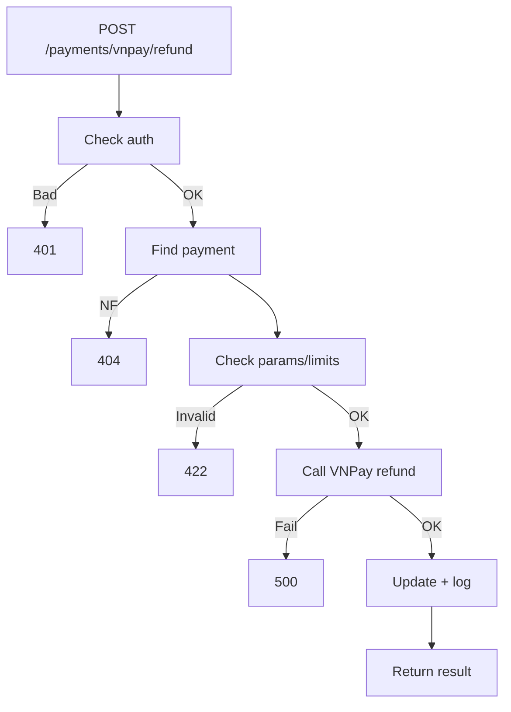

## API Name
Payment: VNPay Refund (POST /api/v1/payments/vnpay/refund)

Purpose: Authenticated user/admin requests a refund for a VNPay transaction. Issues refund with specified amount and logs reason.

### General Information
- **Owner**: backend
- **Version**: v1
- **Status**: ready
- **Audience**: backend, admin, finance, support
---
## 1) Endpoint
- **Method**: POST
- **Base URL**: https://api.example.com
- **Path**: /api/v1/payments/vnpay/refund
- **Auth**: Required (Bearer token)

#### Headers
| Name           | Required | Example              | Description          |
|----------------|----------|----------------------|----------------------|
| Authorization  | Yes      | Bearer <token>       | User/admin token     |
| Content-Type   | Yes      | application/json     | Request format       |

#### Request Body Schema
```json
{
  "transaction_id": "abc123",
  "amount": 90000,
  "reason": "User canceled booking",
  "guest_email": "guest@email.com",   // if guest
  "guest_phone": "+84981231234"       // if guest
}
```
- transaction_id: required
- amount: required, int, refund amount (<= paid)
- reason: required
- guest_email/phone: only for guest refund requests

#### Path Params
N/A
#### Query Params
N/A
---
## 2) Response
#### Error envelope
```json
{"success": false,"message": "...","code": "ERROR_CODE","errors": {}}
```
#### 200 Success Example
```json
{"success": true,"data": {"refund_status": "success",...}}
```
---
#### Common Error Codes
| HTTP | Internal code     | When it happens      | Frontend handling    |
|------|-------------------|----------------------|----------------------|
| 401  | UNAUTHORIZED      | Not logged in        | Prompt login         |
| 404  | NOT_FOUND         | Payment missing      | Error UI             |
| 422  | VALIDATION_ERROR  | Bad input / over-refund | Show details      |
| 500  | INTERNAL_ERROR    | System/failure       | Retry/main support   |
---
## 3) Flow Logic
- Auth required
- Validate permission, fetch payment
- Call VNPay refund API
- Update records, return result

**Mermaid Flowchart:**

---
## 4) Database Impact
payments (update/refund status)
---
## 5) Integrations & External Effects
- VNPay refund API
---
## 6) Security
- Only booking owner or admin
---
## 7) Observability (Logging/Monitoring)
- Refunds logged
---
## 8) Performance & Scalability
Single tx; refund API call
---
## 9) Edge Cases & Business Rules
- Only refundable until paid/settled, only up to paid amount
---
## 10) Testing
- Refund, over-refund, missing tx, multiple roles
---
## 11) Versioning & Deprecation
- v1
---
## 12) Changelog
- [2025-10-30] Initial v1
---
## 13) OpenAPI/Swagger Mapping
PaymentResource
---
## 14) Completion Checklist
[x] Refund logic, errors, audit trail
