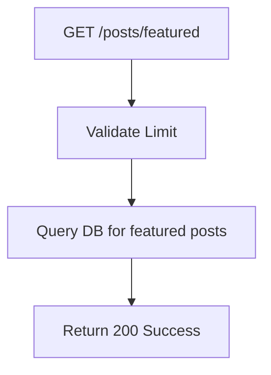

## API Name
Post: List Featured Posts (GET /api/v1/posts/featured)

Purpose: Retrieve a list of posts marked as 'featured' for homepage section or highlight.

### General Information
- **Owner**: backend
- **Version**: v1
- **Status**: ready
- **Audience**: frontend dev | backend dev | QA | customer
- **Related epic/ticket**: [TBD]
---
## 1) Endpoint
- **Method**: GET
- **Base URL**: https://api.example.com
- **Path**: /api/v1/posts/featured
- **Auth**: None
- **Rate limiting**: 60 req/minute
 - **Caching**: Server-side 15 minutes (per locale + limit)

#### Query Params
| Name  | Type | Required | Default | Example | Description                |
|-------|------|----------|---------|---------|----------------------------|
| limit | int  | No       | 6       | 4       | Max number of posts to return. |

#### Headers
| Name         | Required | Example            | Description        |
|--------------|----------|--------------------|--------------------|
| Content-Type | No       | application/json   | Request format     |

#### Path Params
N/A
#### Request Body Schema
N/A
---
## 2) Response
#### Standard error envelope
```json
{
  "success": false,
  "message": "Short error description",
  "code": "ERROR_CODE",
  "errors": {},
  "trace_id": "uuid"
}
```
#### 200 Success Example
```json
{
  "success": true,
  "data": [
      { "id": 77, "title": "Promo launch", "is_featured": true, ... }, ...
  ]
}
```
#### Common Error Codes
| HTTP | Internal code    | When it happens         | Frontend handling |
|------|------------------|-------------------------|-------------------|
| 500  | INTERNAL_ERROR   | Server error            | Retry/support     |
---
## 3) Flow Logic
- Validate 'limit' param (default 6)
- Query DB for is_featured=true up to limit
- Return array of post summaries

**Mermaid Flowchart:**

---
## 4) Database Impact
- Table: posts (SELECT WHERE is_featured=true, LIMIT)
---
## 5) Integrations & External Effects
None
---
## 6) Security
- None
---
## 7) Observability (Logging/Monitoring)
- Track fetches and frequency
---
## 8) Performance & Scalability
- Smallish set, indexed on is_featured
---
## 9) Edge Cases & Business Rules
- Empty list if none found
---
## 10) Testing
- Few/none/many featured, limit values
- Example:
```bash
curl "https://api.example.com/api/v1/posts/featured?limit=4"
```
---
## 11) Versioning & Deprecation
- v1
---
## 12) Changelog
- [2025-10-30] Initial version – ENGLISH
---
## 13) OpenAPI/Swagger Mapping
- Component: PostResource, ApiEnvelope
---
## 14) Completion Checklist
- [x] Endpoint clear
- [x] Request schema/validation
- [x] Response schema/error codes
- [x] Mermaid chart/logic
- [x] DB impact
- [x] Logging/metrics
- [x] Performance/test/FE example
- [x] OpenAPI mapping
