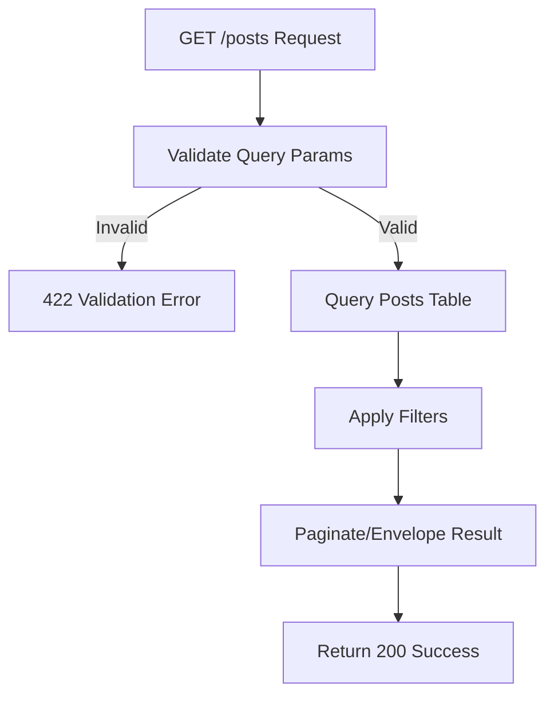

## API Name
Post: List Posts (GET /api/v1/posts)

Purpose: Returns a paginated list of news, blog, or announcement posts. Supports filtering by category, tag, and featured.

### General Information
- **Owner**: backend
- **Version**: v1
- **Status**: ready
- **Audience**: frontend dev | backend dev | customer | QA
- **Related epic/ticket**: [TBD]
---
## 1) Endpoint
- **Method**: GET
- **Base URL**: https://api.example.com
- **Path**: /api/v1/posts
- **Auth**: None
- **Rate limiting**: 60 req/minute
- **Caching**: May cache per use-case

#### Headers
| Name         | Required | Example            | Description        |
|--------------|----------|--------------------|--------------------|
| Content-Type | No       | application/json   | Request format     |

#### Query Params
| Name        | Type    | Required | Example | Description                     |
|-------------|---------|----------|---------|---------------------------------|
| page        | int     | No       | 2       | Pagination page                 |
| per_page    | int     | No       | 10      | Items per page                  |
| category_id | int     | No       | 5       | Filter by category              |
| tag_id      | int     | No       | 11      | Filter by tag                   |
| featured    | bool    | No       | true    | Filter for featured posts        |

#### Path Params
N/A
#### Request Body Schema
N/A
---
## 2) Response
#### Standard error envelope
```json
{
  "success": false,
  "message": "Short error description",
  "code": "ERROR_CODE",
  "errors": {},
  "trace_id": "uuid"
}
```
#### 200 Success Example
```json
{
  "success": true,
  "data": [
    {
      "id": 67,
      "category_id": 5,
      "title": "How to book online",
      "slug": "how-to-book-online",
      "excerpt": "Easily book on our site...",
      "is_featured": false,
      "views_count": 12,
      "created_at": "2025-10-30T10:23:00Z",
      ...
    }, ...
  ],
  "meta": { "pagination": { "page": 2, "per_page": 10, "total": 43 } }
}
```
#### Common Error Codes
| HTTP | Internal code    | When it happens         | Frontend handling |
|------|------------------|-------------------------|-------------------|
| 400  | VALIDATION_ERROR | Invalid query params    | Show field error  |
| 500  | INTERNAL_ERROR   | Server error            | Retry/support     |
---
## 3) Flow Logic
- Validate query params (pagination, optional filtering)
- Query database for matching posts (with relations included as needed)
- Return paginated envelope

**Mermaid Flowchart:**

---
## 4) Database Impact
- Table: posts (SELECT, paginated, filters)
---
## 5) Integrations & External Effects
None
---
## 6) Security
- Public endpoint
---
## 7) Observability (Logging/Monitoring)
- Log request volume/latency
---
## 8) Performance & Scalability
- Paginated, can cache hot queries
---
## 9) Edge Cases & Business Rules
- Empty result if no post matches
---
## 10) Testing
- Valid/invalid/empty, category, tag, featured filters
- Example:
```bash
curl "https://api.example.com/api/v1/posts?category_id=6&page=2"
```
---
## 11) Versioning & Deprecation
- v1
---
## 12) Changelog
- [2025-10-30] Initial version – ENGLISH
---
## 13) OpenAPI/Swagger Mapping
- Component: PostResource, ApiEnvelope
---
## 14) Completion Checklist
- [x] Endpoint clear
- [x] Request schema/validation
- [x] Response schema/error codes
- [x] Mermaid chart/logic
- [x] DB impact
- [x] Security
- [x] Logging/metrics
- [x] Test/FE example
- [x] OpenAPI mapping
