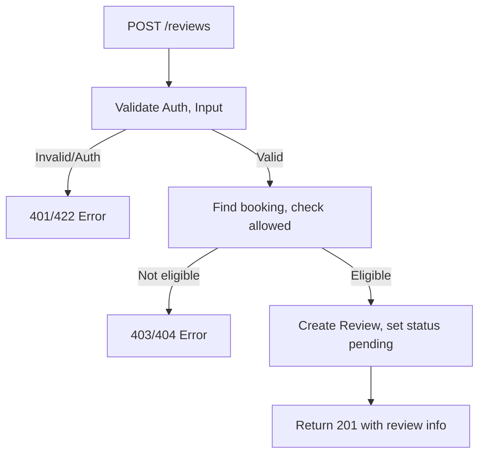

## API Name
Review: Create Review for Booking (POST /api/v1/reviews)

Purpose: Lets an authenticated user submit a review for a booking they've completed. Used for feedback, rating, and QA.

### General Information
- **Owner**: backend
- **Version**: v1
- **Status**: ready
- **Audience**: frontend dev | backend dev | customer | QA
- **Related epic/ticket**: [TBD]
---
## 1) Endpoint
- **Method**: POST
- **Base URL**: https://api.example.com
- **Path**: /api/v1/reviews
- **Auth**: Required (Bearer token / Sanctum)
- **Rate limiting**: 20 req/user/day

#### Headers
| Name           | Required | Example              | Description             |
|----------------|----------|----------------------|-------------------------|
| Authorization  | Yes      | Bearer <token>       | User authentication     |
| Content-Type   | Yes      | application/json     | Request format          |

#### Request Body Schema
```json
{
  "booking_id": 1011,
  "rating": 5,
  "comment": "Very nice!",
  "images": ["/img/review1.jpg"]
}
```
- booking_id: required (int, booking must exist)
- rating: required (1-5 int)
- comment: required (string)
- images: optional (array of image URL/paths)

#### Path Params
N/A
#### Query Params
N/A
---
## 2) Response
#### Standard error envelope
```json
{
  "success": false,
  "message": "Short error description",
  "code": "ERROR_CODE",
  "errors": {},
  "trace_id": "uuid"
}
```
#### 201 Success Example
```json
{
  "success": true,
  "data": {
    "id": 312,
    "booking_id": 1011,
    "rating": 5,
    "comment": "Very nice!",
    ...
  },
  "message": "Review submitted and is pending moderation."
}
```
#### Common Error Codes
| HTTP | Internal code     | When it happens                     | Frontend handling   |
|------|-------------------|-------------------------------------|---------------------|
| 401  | UNAUTHORIZED      | Not logged in                       | Require login       |
| 403  | FORBIDDEN         | Not allowed to review this booking  | Show info           |
| 404  | BOOKING_NOT_FOUND | Booking does not exist              | Explain/correct     |
| 422  | VALIDATION_ERROR  | Invalid field(s)                    | Show input error    |
| 429  | RATE_LIMITED      | Too many reviews                    | Delay/prompt later  |
| 500  | INTERNAL_ERROR    | Server error                        | Retry/support       |
---
## 3) Flow Logic
- Auth user, validate body (booking/rating/comment)
- Check booking eligibility/completion
- Accept, set status = pending (moderation)
- Return confirmation and review info

**Mermaid Flowchart:**

---
## 4) Database Impact
- Table: reviews (INSERT, status = pending)
---
## 5) Integrations & External Effects
- None in public endpoint (moderation/notify handled internally)
---
## 6) Security
- Must be owner/user of booking, rate limit per user
---
## 7) Observability (Logging/Monitoring)
- Log review create & moderation status
---
## 8) Performance & Scalability
- Moderate write volume, can queue moderation
---
## 9) Edge Cases & Business Rules
- Can review only after booking completed & only once
---
## 10) Testing
- Happy, not allowed, invalid, repeated, race
- Example:
```bash
curl -X POST "https://api.example.com/api/v1/reviews" -H "Authorization: Bearer <token>" -H "Content-Type: application/json" -d '{"booking_id":1011,"rating":5,"comment":"Great!"}'
```
---
## 11) Versioning & Deprecation
- v1
---
## 12) Changelog
- [2025-10-30] Initial version – ENGLISH
---
## 13) OpenAPI/Swagger Mapping
- Component: ReviewResource, ApiEnvelope
---
## 14) Completion Checklist
- [x] Endpoint clear
- [x] Request schema & validation
- [x] Response schema/error codes
- [x] Mermaid chart/flow
- [x] DB impact
- [x] Test/FE example
- [x] OpenAPI mapping
