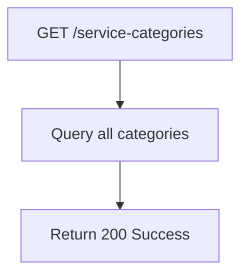

## API Name
Service: List Service Categories (GET /api/v1/service-categories)

Purpose: Returns the list of available service categories (e.g., facial, massage) with localization support.

### General Information
- **Owner**: backend
- **Version**: v1
- **Status**: ready
- **Audience**: frontend dev | backend dev | QA | customer
- **Related epic/ticket**: [TBD]
---
## 1) Endpoint
- **Method**: GET
- **Base URL**: https://api.example.com
- **Path**: /api/v1/service-categories
- **Auth**: None
- **Rate limiting**: 60 req/minute
- **Caching**: Server-side 60 minutes (per locale); clients may additionally cache

#### Headers
| Name         | Required | Example            | Description        |
|--------------|----------|--------------------|--------------------|
| Content-Type | No       | application/json   | Request format     |

#### Path Params
N/A
#### Query Params
N/A
#### Request Body Schema
N/A
---
## 2) Response
#### Standard error envelope
```json
{
  "success": false,
  "message": "Short error description",
  "code": "ERROR_CODE",
  "errors": {},
  "trace_id": "uuid"
}
```
#### 200 Success Example
```json
{
  "success": true,
  "data": [
    { "id": 1, "name": "Facial", "slug": "facial" },
    { "id": 2, "name": "Massage", "slug": "massage" }
  ]
}
```
#### Common Error Codes
| HTTP | Internal code    | When it happens      | Frontend handling |
|------|------------------|----------------------|-------------------|
| 500  | INTERNAL_ERROR   | Server error         | Retry/support     |
---
## 3) Flow Logic
- Fetch all categories, localize name
- Return category data array

**Mermaid Flowchart:**

---
## 4) Database Impact
- Table: service_categories (SELECT ALL)
---
## 5) Integrations & External Effects
None
---
## 6) Security
- None (public)
---
## 7) Observability (Logging/Monitoring)
- Log failures/latency
---
## 8) Performance & Scalability
- Highly cacheable, fast
---
## 9) Edge Cases & Business Rules
- No categories defined = empty list
---
## 10) Testing
- None/some/many categories
- Example:
```bash
curl "https://api.example.com/api/v1/service-categories"
```
---
## 11) Versioning & Deprecation
- v1
---
## 12) Changelog
- [2025-10-30] Initial version – ENGLISH
---
## 13) OpenAPI/Swagger Mapping
- Component: CategoryList, ApiEnvelope
---
## 14) Completion Checklist
- [x] Endpoint clear
- [x] Response schema/error codes
- [x] Mermaid chart/logic
- [x] DB impact
- [x] Logging/metrics
- [x] Test/FE example
- [x] OpenAPI mapping
