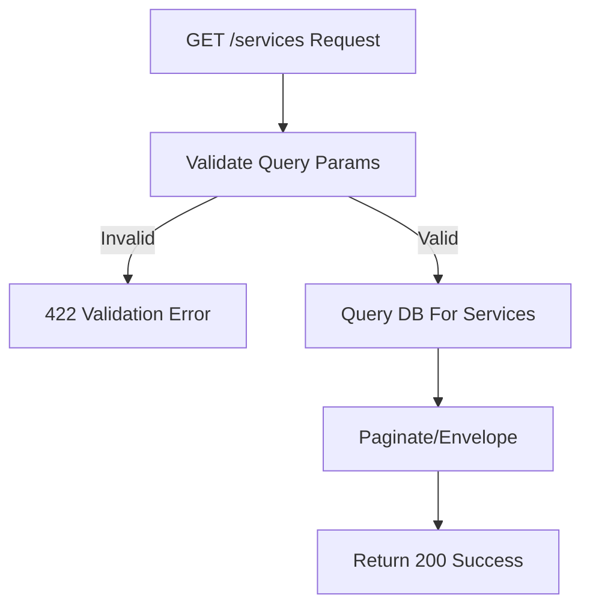

## API Name
Service: List Services (GET /api/v1/services)

Purpose: Returns a paginated list of beauty/service items available (with optional filters in advanced usage).

### General Information
- **Owner**: backend
- **Version**: v1
- **Status**: ready
- **Audience**: frontend dev | backend dev | customer | QA
- **Related epic/ticket**: [TBD]
---
## 1) Endpoint
- **Method**: GET
- **Base URL**: https://api.example.com
- **Path**: /api/v1/services
- **Auth**: None
- **Rate limiting**: 60 req/minute
- **Caching**: (Optional: ETag/Cache-Control)

#### Headers
| Name         | Required | Example            | Description        |
|--------------|----------|--------------------|--------------------|
| Content-Type | No       | application/json   | Request format     |

#### Query Params
| Name      | Type | Required | Default | Example | Description          |
|-----------|------|----------|---------|---------|----------------------|
| page      | int  | No       | 1       | 2       | Pagination page      |
| per_page  | int  | No       | 20      | 50      | Items per page       |

#### Path Params
N/A
#### Request Body Schema
N/A
---
## 2) Response
#### Standard error envelope
```json
{
  "success": false,
  "message": "Short error description",
  "code": "ERROR_CODE",
  "errors": {},
  "trace_id": "uuid"
}
```
#### 200 Success Example
```json
{
  "success": true,
  "data": [
    {
      "id": 1,
      "category": {"id": 2, "name": "Facial", "slug": "facial"},
      "name": "Premium Facial",
      "slug": "premium-facial",
      "price": 500000,
      "short_description": "Cleanse & rejuvenate",
      "duration": 60,
      "is_featured": true,
      ...
    }, ...
  ],
  "meta": { "pagination": { "page": 1, "per_page": 20, "total": 13 } }
}
```
#### Common Error Codes
| HTTP | Internal code    | When it happens         | Frontend handling |
|------|------------------|-------------------------|-------------------|
| 400  | VALIDATION_ERROR | Invalid query params    | Show error        |
| 500  | INTERNAL_ERROR   | Server error            | Retry/support     |
---
## 3) Flow Logic
- Validate query params
- Fetch paginated services from DB
- Optional: filter/sort (advanced usage)
- Return results (meta with pagination)

**Mermaid Flowchart:**

---
## 4) Database Impact
- Table: services (SELECT, paginated)
---
## 5) Integrations & External Effects
None
---
## 6) Security
- None (public endpoint)
---
## 7) Observability (Logging/Monitoring)
- Log requests, performance
---
## 8) Performance & Scalability
- Standard, paginated, can cache/ETag
---
## 9) Edge Cases & Business Rules
- Empty result if no services in DB
---
## 10) Testing
- Empty/full, valid/invalid query params
- Example:
```bash
curl "https://api.example.com/api/v1/services?page=2&per_page=10"
```
---
## 11) Versioning & Deprecation
- v1
---
## 12) Changelog
- [2025-10-30] Initial version – ENGLISH
---
## 13) OpenAPI/Swagger Mapping
- Component: ServiceResource, ApiEnvelope
---
## 14) Completion Checklist
- [x] Endpoint clear
- [x] Request schema/validation
- [x] Response schema/error codes
- [x] Mermaid chart/logic
- [x] DB impact
- [x] Security
- [x] Logging/metrics
- [x] Test/FE example
- [x] OpenAPI mapping
