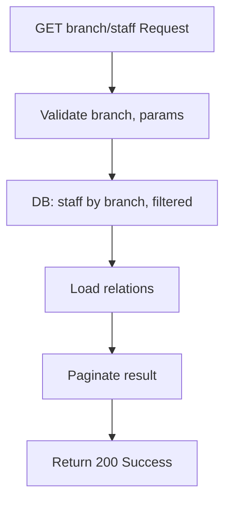

## API Name
Staff: List Staff by Branch (GET /api/v1/branches/{branch}/staff)

Purpose: Returns a paginated list of staff filtered by branch, with optional sorting/filtering. Public endpoint.

### General Information
- **Owner**: backend
- **Version**: v1
- **Status**: ready
- **Audience**: frontend dev | backend dev | QA | customer
- **Related epic/ticket**: [TBD]
---
## 1) Endpoint
- **Method**: GET
- **Base URL**: https://api.example.com
- **Path**: /api/v1/branches/{branch}/staff
- **Auth**: None (public)
- **Rate limiting**: 60 req/minute

#### Path Params
| Name   | Type | Required | Example | Description         |
|--------|------|----------|---------|---------------------|
| branch | int  | Yes      | 3       | Branch ID           |

#### Query Params
| Name       | Type   | Required | Example         | Description                                   |
|------------|--------|----------|-----------------|------------------------------------------------|
| page       | int    | No       | 2               | Pagination page                               |
| per_page   | int    | No       | 10              | Items per page                                |
| sort       | string | No       | rating          | Which field to sort by (id, rating, years_of_experience) |
| direction  | string | No       | asc             | Sort order (asc or desc)                      |
| include    | string | No       | services        | Relations to include: user,branch,services    |
| position   | string | No       | therapist       | Filter by position string (partial LIKE)      |

#### Headers
| Name         | Required | Example          | Description        |
|--------------|----------|------------------|--------------------|
| Content-Type | No       | application/json | Request format     |

#### Request Body Schema
N/A
---
## 2) Response
#### Standard error envelope
```json
{
  "success": false,
  "message": "Short error description",
  "code": "ERROR_CODE",
  "errors": {},
  "trace_id": "uuid"
}
```
#### 200 Success Example
```json
{
  "success": true,
  "data": [
    {
      "id": 12,
      "name": "Tran B",
      "branch": {"id":3, "name": "Branch 3"},
      "services": [ {"id":5,"name": "Body Massage"} ],
      "rating": 4.9,
      ...
    } ...
  ],
  "meta": { "pagination": { "page": 1, "per_page": 10, "total": 23 } }
}
```
#### Common Error Codes
| HTTP | Internal code    | When it happens         | Frontend handling |
|------|------------------|-------------------------|-------------------|
| 400  | VALIDATION_ERROR | Invalid query params    | Show error        |
| 500  | INTERNAL_ERROR   | Server error            | Retry/support     |
---
## 3) Flow Logic
- Parse and validate branch and query params
- Query staff for branch with filters
- Support relations, sorting, direction
- Paginate results

**Mermaid Flowchart:**

---
## 4) Database Impact
- Table: staff (SELECT, filter branch), paginated
---
## 5) Integrations & External Effects
None
---
## 6) Security
- Public
---
## 7) Observability (Logging/Monitoring)
- Log queries/errors
---
## 8) Performance & Scalability
- Covered by branch+staff indexes
---
## 9) Edge Cases & Business Rules
- No staff for branch = empty
---
## 10) Testing
- Valid/invalid branch, page, filter
- Example:
```bash
curl "https://api.example.com/api/v1/branches/3/staff?page=2&per_page=5"
```
---
## 11) Versioning & Deprecation
- v1
---
## 12) Changelog
- [2025-10-30] Initial version – ENGLISH
---
## 13) OpenAPI/Swagger Mapping
- Component: StaffResource, ApiEnvelope
---
## 14) Completion Checklist
- [x] Endpoint clear
- [x] Request schema & validation
- [x] Response schema/error codes
- [x] Mermaid chart/logic
- [x] DB impact
- [x] Performance/scaling
- [x] Test/FE example
- [x] OpenAPI mapping
