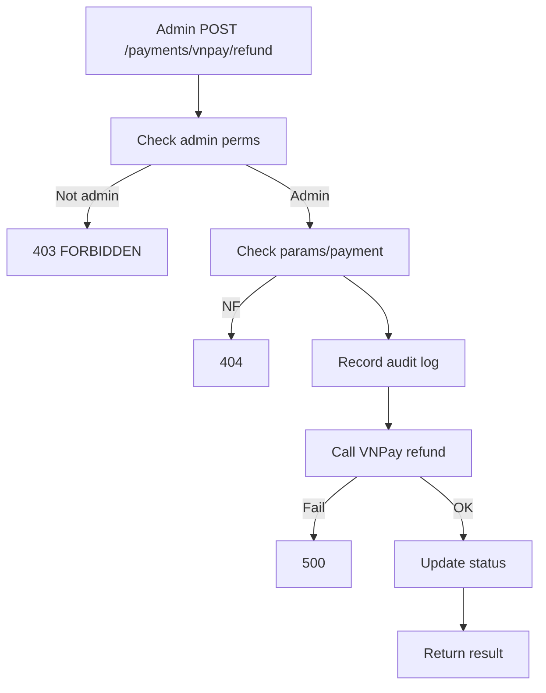

## API Name
Admin: Manual VNPay Refund (POST /api/v1/payments/vnpay/refund)

Purpose: Admin can trigger/refund payments in edge, dispute or support cases. Includes audit trail, stricter access. IRL, this would be a dedicated admin endpoint, but for this project, same endpoint with admin role is permitted.

### General Information
- **Owner**: backend/admin
- **Version**: v1
- **Status**: ready
- **Audience**: admin, finance, support
---
## 1) Endpoint
- **Method**: POST
- **Base URL**: https://api.example.com
- **Path**: /api/v1/payments/vnpay/refund
- **Auth**: Required (Bearer token, admin only)

#### Headers
| Name           | Required | Example              | Description          |
|----------------|----------|----------------------|----------------------|
| Authorization  | Yes      | Bearer <admin_token> | Must be admin        |
| Content-Type   | Yes      | application/json     | Request format       |

#### Request Body/Schema
Refer to public doc (`guest_email`, `guest_phone`, `amount`, etc.)
---
## 2) Response
Same as user version; add audit info in logs.
---
## 3) Flow Logic
- Check admin role
- Validate params, find original payment, enforce amount/refund logic
- Log admin action with user, timestamp, IP
- Call VNPay refund API
- Update records

**Mermaid Flowchart:**

---
## 4) Database Impact
- payments: status update, audit records
---
## 5) Integrations & External Effects
- VNPay refund
---
## 6) Security
- Only admin role allowed, log all actions
---
## 7) Observability (Logging/Monitoring)
- Audit log: admin, action, timestamp
---
## 8) Performance & Scalability
Single tx
---
## 9) Edge Cases & Rules
- Multiple refunds, over-limit, fraud checks
---
## 10) Testing
- Admin refund, fail non-admin
---
## 11) Versioning & Deprecation
v1
---
## 12) Changelog
2025-10-30 – v1 admin doc
---
## 13) OpenAPI/Swagger Mapping
PaymentResource
---
## 14) Completion Checklist
[x] Admin auth, audit, extra edge cases
