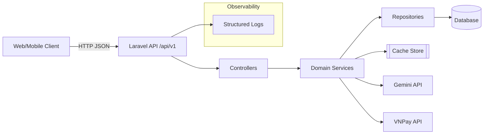
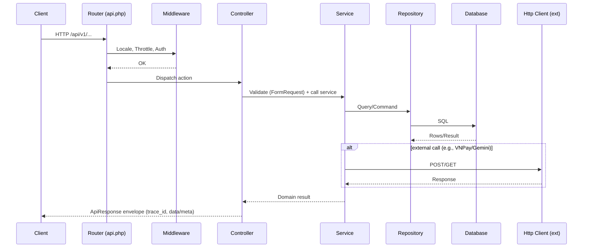
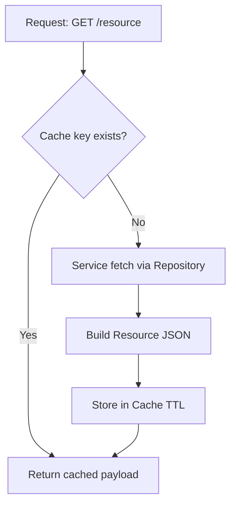
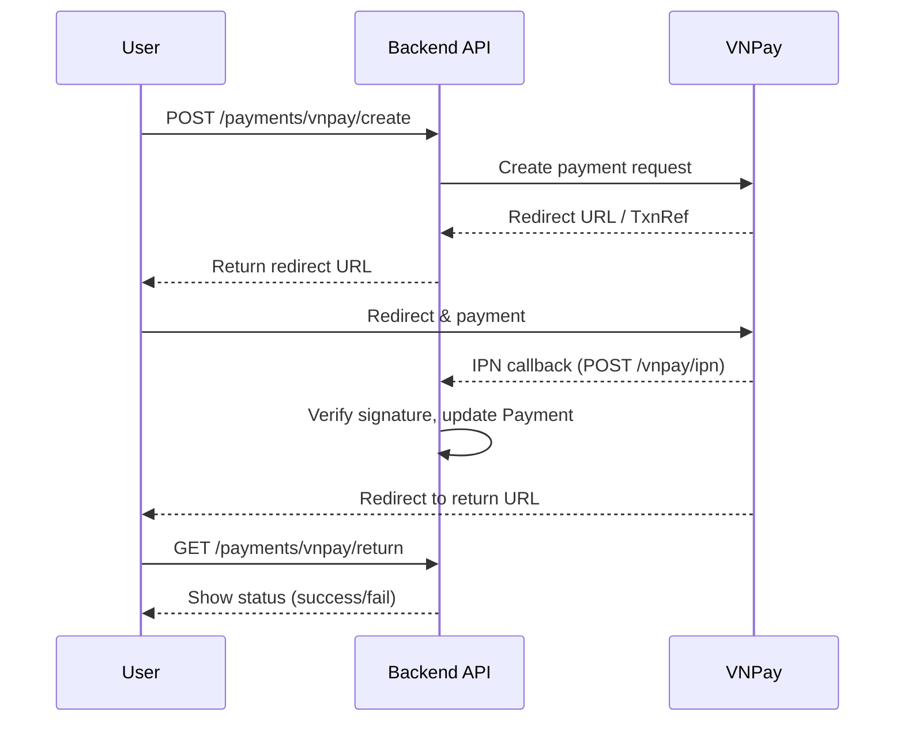
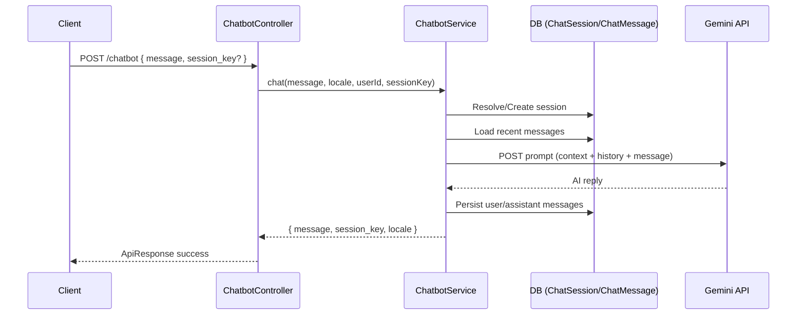

## Backend Architecture (Laravel 12)

This document explains the backend architecture of the project: layers, module boundaries, request lifecycle, cross-cutting concerns, data access, caching, security, observability, and operational concerns. It is derived from the current source tree and conventions used in the codebase.

---

### High-level Overview

- Framework: Laravel 12 (PHP ^8.2)
- Application style: Modular monolith, REST APIs (versioned `/api/v1`)
- Layers:
  - HTTP (Controllers, Requests, Middleware)
  - Domain Services (business logic)
  - Repositories (persistence abstraction)
  - Eloquent Models (Active Record for simple mapping)
  - Resources (API serialization)
  - DTOs (spatie/laravel-data) for typed data at boundaries
- Cross-cutting:
  - Response Envelope (`ApiResponse`) with `trace_id`, timestamps
  - Validation via `FormRequest`
  - Rate limiting via route middleware
  - Caching via Laravel Cache (store: database by default)
  - OpenAPI via `l5-swagger` annotations
  - i18n with locale middleware and translations in `resources/lang`
  - Payments integration (VNPay), Chatbot integration (Gemini API)

---

### System Context (Mermaid)

---

### Source Layout (Key Folders)

- `app/Http/Controllers/Api/V1/*`: REST controllers per domain (Auth, Service, Branch, Booking, Payment, Review, Post, Contact, Chatbot, ChatRealTime, Profile, Staff)
- `app/Http/Requests/*`: Validation classes per endpoint
- `app/Http/Resources/*`: Transformers mapping models → API JSON
- `app/Http/Middleware/*`: locale, throttling, auth-related concerns
- `app/Http/Responses/ApiResponse.php`: Standard response envelope helpers
- `app/Services/*`: Domain services; `Contracts` folder holds interfaces
- `app/Repositories/*`: `Contracts` + `Eloquent` implementations
- `app/Models/*`: Eloquent models for all domain entities
- `app/Data/*`: DTOs using spatie/laravel-data
- `config/*`: Core configs (app, database, cache, chatbot, l5-swagger, sanctum, vnpay, etc.)
- `routes/api.php`: All API v1 routes; grouped middleware: locale + throttle
- `database/*`: migrations, factories, seeders; local sqlite for dev
- `docs/*`: API specs and architecture docs

---

### Request Lifecycle (API)

1. Client sends HTTP request to `/api/v1/...`.
2. Route matches in `routes/api.php` under middleware:
   - Locale middleware (sets `app()->setLocale()` from header/query)
   - `throttle:api` group and `throttle:60,1` per v1
   - `auth:sanctum` group for protected routes
3. Controller action resolves corresponding `FormRequest` (validation, authorization)
4. Controller delegates to Service (no business logic in controllers)
5. Service orchestrates repositories and domain logic; calls external APIs if needed
6. Controller returns `Resource` data within `ApiResponse` envelope
7. `ApiResponse` adds `trace_id` (from headers if present) and UTC timestamp

---

### Request Lifecycle Diagram

---

### Layer Responsibilities

- Controllers
  - Map HTTP → service calls
  - Apply response envelope helpers: `ok`, `created`, `paginated`, `notFound`, etc.
  - Implement read caching for list/detail endpoints using `Cache::remember`
  - Keep thin and declarative; no domain branching logic

- FormRequests (Validation)
  - Validate input types, sizes, constraints (e.g., pagination bounds)
  - Localized validation messages via translations
  - Authorization hook for per-endpoint access control when needed

- Services
  - Contain business logic and orchestrate repositories
  - Apply derived field logic (e.g., slug generation) and invariants
  - Integrate with external systems (Gemini, VNPay) via Laravel HTTP client

- Repositories
  - Encapsulate querying and persistence using Eloquent
  - Provide interfaces for testability and clear boundaries

- Models (Eloquent)
  - Map tables to objects; define relationships, casts, fillable
  - Avoid putting business logic here; keep them lean

- Resources
  - Control API surface (which fields to expose)
  - Consistent timestamps and relation projections

- DTOs
  - Strongly typed data structures at service boundaries for clarity

---

### Response Envelope

All responses follow a standard shape from `ApiResponse`:
- `success`: boolean
- `message`: string (localized)
- `data`: payload (object/array/null)
- `error`: { `type`, `code`, `details`? }
- `meta`: pagination or extra context
- `trace_id`: cross-request correlation id
- `timestamp`: ISO UTC string

Envelope helpers ensure consistency and reduce frontend parsing complexity.

---

### Routing and Versioning

- Versioned path: `/api/v1/...`
- Route groups apply locale + throttling; protected routes use `auth:sanctum`
- Controllers are imported with aliases (e.g., `V1PostController`)

---

### Authentication & Authorization

- Laravel Sanctum for API authentication (`auth:sanctum` middleware)
- Public endpoints: services, branches, posts (read-only), chatbot, contact
- Authenticated-only: payments listing, profile, staff chat, reviews moderation
- Role checks enforced in controllers/services (admin/staff-specific endpoints)

---

### Caching Strategy

- Store: `database` by default (configurable to Redis/File/Memcached)
- Pattern: cache READ endpoints (lists/detail) with keys:
  - `resource.action:locale:md5(query)` for lists
  - `resource.show:locale:idOrSlug` for detail
- TTLs:
  - Lists: 5 minutes
  - Details: 15 minutes
  - Dictionaries (categories/tags): 60 minutes
- Admin/mutation endpoints: no caching
- Invalidation: on create/update/delete, clear affected keys (consider Redis tags for grouping)

---

### Caching Flow (Read Path)

---

### Internationalization (i18n)

- Locale middleware sets locale from headers/query
- Translations under `resources/lang/<locale>` used for messages and some field labels
- `HasLocalization` trait provides helpers for locale-aware fields

---

### Error Handling

- Centralized envelope for errors with `type`, `code`, `trace_id`
- Common HTTP → internal code mapping documented in API template
- `ResourceNotFoundException` for 404 flows; controller `notFound()` throws/handles accordingly
- Validation errors return 400/422 with field-level details

---

### Observability

- `trace_id` propagated in `ApiResponse` (from `X-Request-Id` / `X-Correlation-Id` or generated)
- Logging: Laravel default + custom Daily JSON formatter
- External API calls log status and body (safe subset) on failure
- Metrics concepts: latency, error rate per endpoint (documented; can be wired to APM if available)

---

### Security

- Input validation and type constraints in FormRequests
- Rate limiting on all API routes (`throttle:60,1`)
- Sanctum tokens for authenticated routes; admin/staff checks on moderation and staff chat
- Sensitive data masking in logs; never log secrets or full payloads for payments
- CSRF not applicable for stateless JSON APIs; idempotency recommended for payment-like operations

---

### Domain Modules (Selected)

- Services & Branches
  - List, detail, categories; caching enabled per route TTL
  - `ServiceController`, `BranchController`; resources for output

- Posts (Blog)
  - List, detail, featured, categories, tags; caching enabled
  - `PostController` manages pagination and filters; increments views on show

- Reviews
  - Public read; authenticated create
  - Admin moderation (pending, approve, reject, respond) under auth-protected routes

- Payments (VNPay)
  - Create, return, ipn, refund, query endpoints
  - `PaymentService` coordinates with VNPay sandbox
  - User payments listing under auth

- Chatbot
  - `ChatbotService` integrates Gemini API; builds business context from branches/services
  - Persists chat sessions/messages; supports guest sessions with `session_key`

- Chat Real-time (REST-based simulation)
  - Guest session creation, send message, get new messages (polling), transfer to human
  - Staff messaging and assigned sessions (auth required)

---

### Data Access Layer

- Eloquent Models define relations, casts, and fillable
- Repositories abstract queries; interfaces in `Repositories/Contracts`
- Services depend on repository interfaces for testability

---

### DTOs and Resources

- DTOs (spatie/laravel-data) standardize data crossing boundaries (e.g., chat session/message payloads)
- Resources shape API outputs; nested relations included via `whenLoaded` to avoid N+1

---

### OpenAPI / Swagger

- Controllers include `@OA` annotations per endpoint
- Generate docs: `php artisan l5-swagger:generate`
- Output JSON under `storage/api-docs`; served by Swagger UI (per l5-swagger config)
- API docs mirrored in `docs/api/*` using a common template with examples and Mermaid flows

---

### Testing Strategy

- Feature tests under `tests/Feature/Api/V1/*` for endpoint behaviors and envelopes
- Unit tests under `tests/Unit/*` for services and business logic
- Factories and seeders to set up repeatable data

---

### Configuration and Environment

- `config/app.php`: timezone `Asia/Ho_Chi_Minh`, default locale from `.env`
- `config/cache.php`: default store `database`, optional redis/file/memcached
- `config/database.php`: MySQL default; Postgres/SQL Server options; Redis client `phpredis`
- `config/chatbot.php`: Gemini model + generation parameters + business context
- `config/vnpay.php`: VNPay sandbox credentials/URLs
- Secrets via `.env` variables (API keys, DB credentials)

---

### Performance Considerations

- Pagination on all list endpoints
- Query indexes aligning with filters/sorts
- Read caching with short TTL to reduce DB load
- Avoid N+1 via eager loading in repositories/services where needed

---

### Deployment & Operations (General Notes)

- Stateless app servers; sessionless API
- Cache store: database by default (suitable for single-node or small scale); prefer Redis for multi-node setups
- Queue workers recommended for email and long-running tasks (composer `dev` script shows `queue:listen` for local)
- Logging shipped as JSON for aggregation (DailyJsonFormatter)

---

### Extending the System (How-To)

To add a new domain (e.g., Product):
1) Create migration and model
2) Add repository interface + Eloquent implementation; bind in `AppServiceProvider`
3) Add service interface + implementation; bind in `AppServiceProvider`
4) Create FormRequests for input validation
5) Create Resource(s) for output
6) Add Controller (thin) with cache for read endpoints
7) Wire routes in `routes/api.php` under `/api/v1`
8) Add OpenAPI annotations and docs in `docs/api/<domain>`
9) Add feature + unit tests
10) (Optional) Add caching invalidation hooks on create/update/delete

---

### Risks and Future Enhancements

- Cache invalidation: introduce cache tags with Redis for easier group eviction
- Observability: add metrics/alerts integration (e.g., Prometheus, Sentry)
- Security: formalize role/permission model (Policies/Gates per domain)
- Real-time chat: move from polling to WebSockets if needed (Laravel Reverb/Pusher)
- Search: add full-text or external search if posts/services grow large
- CI/CD: add static analysis, tests, security scans in pipeline

---

### Summary

The backend follows a clean layered architecture with strong validation, a consistent response envelope, documented APIs, and pragmatic caching. It integrates external services (Gemini, VNPay) via dedicated services, and it keeps controllers slim while concentrating business rules in services and data access in repositories. The structure supports iterative growth and ease of onboarding.

---

### Sequences for External Integrations

#### VNPay Payment Flow (Simplified)

#### Chatbot Flow (Gemini)

