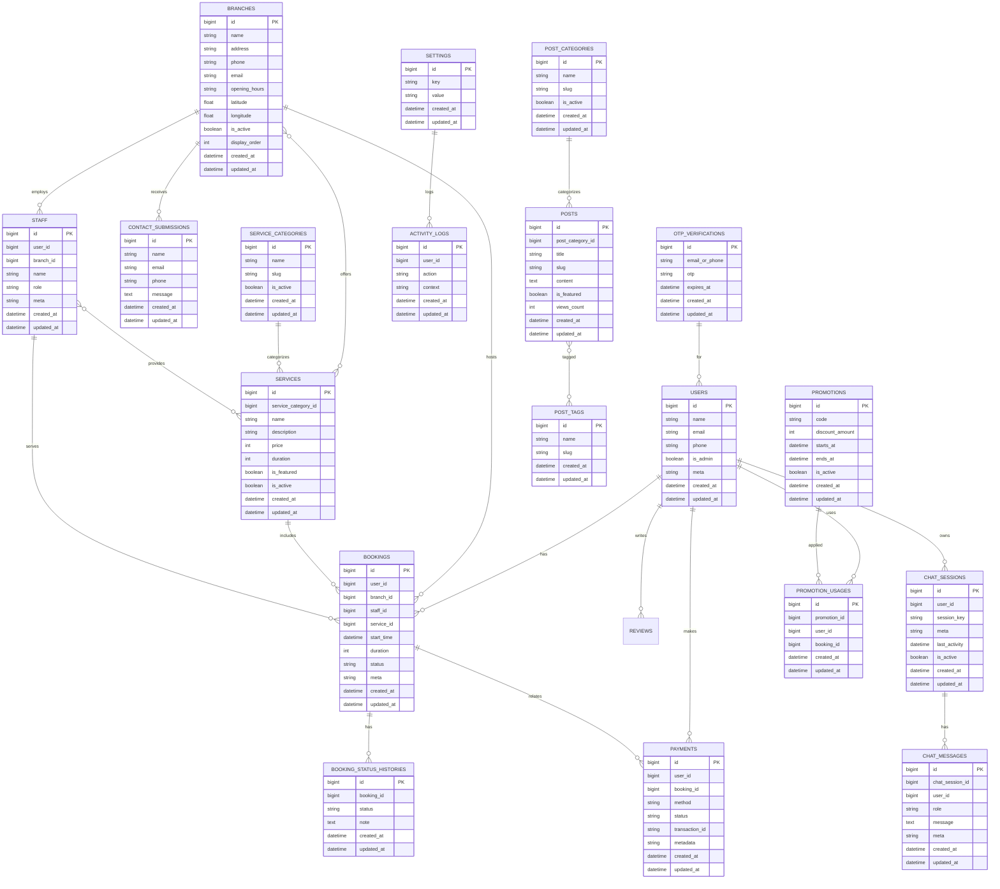

## Database ERD (Mermaid)

This diagram reflects the current domain entities and relationships inferred from models and migrations.

Notes
- Many-to-many: `branches`↔`services`, `staff`↔`services` realized via pivot tables (not expanded here).
- Some fields/types inferred from models and typical conventions.

